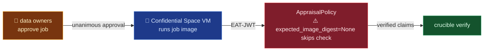

# pysyft/syft-enclave

## Mental model
2-4 plain sentences plus one analogy. What it is, and what role it plays for Crucible.

## Pinned vs local
Crucible pins `syft-enclave==0.1.1`; this note describes local `dev` at the `source:` commit
(0.1.2). The plan's "pin vs HEAD" list: 7 changed, 0 HEAD-only, 0 pin-only.
- **HEAD only:** <behaviour the pin lacks, with the HEAD `path:line>` and how you checked the pin
  (`.venv/lib/python3.12/site-packages/syft_enclaves/...`)>. Claims marked **[HEAD only]** below
  don't hold for what Crucible runs.
- **Differs at the pin:** <same feature, different behaviour or default, both `path:line`s>.
- **Same at the pin:** <the load-bearing claims you checked in the pinned copy>.

## Surface Crucible touches
- `AppraisalPolicy` (`packages/syft-enclave/src/syft_enclaves/attestation.py:42`) — what it does,
  and how Crucible uses it or would use it.

## Defaults & invariants that matter
- `expected_image_digest=None` (`attestation.py:57`) skips the digest check. Crucible has to set it,
  because an unpinned image means the approval every owner gave covers nothing.

## Watch list
- What's moving upstream that Crucible depends on: open PRs or asks, TODOs, half-built paths.

<!--
Rules:
- Present tense, present truth. Never "Update (date):" or "previously X, now Y". The report
  carries change history; the note carries only what's true at the stamped commit.
- Cite file:line for every symbol and default. The reader verifies before acting.
- `## Pinned vs local` is required whenever the plan's "pin vs HEAD" line says files differ
  (stamp refuses the note otherwise), and omitted when the pin is identical or not installed. The
  source for it is the plan's changed / HEAD-only / pin-only list. Open the pinned copy in `.venv`
  for every file a claim rests on. Any claim elsewhere in the note that doesn't hold at the pin
  carries an inline **[HEAD only]** or **[pin: <how it differs>]** tag.
- Security claims need proof, not a reading of the main path. Claims about egress, auth,
  encryption, sandboxing, listening sockets, or a safe default are decided in places the main
  code path doesn't show: container entrypoints and bootstrap code (e.g. `docker/entrypoint.sh`,
  a CLI's `up`), env-var fallbacks (grep `environ` / `getenv` next to a URL), every outbound
  client (grep `https://`, `httpx`, `requests`, `urlopen`), and each default parameter value on
  the public entry point. Absolute words ("never", "only", "every", "all", "structurally") need
  the grep that rules out a counterexample. Without it, write what you checked and where.
- Stay under ~150 lines. Cover the `focus` from the manifest; skip internals Crucible never touches.
- Leave `source:` alone. The stamp script owns it.
- Diagram: exactly ONE mermaid block under Mental model, only when the module has a flow (data,
  requests, lifecycle). Catalog/inventory modules skip it. `flowchart LR`, 4-8 nodes, input left
  to Crucible's touch point right; every edge labelled with what moves. Colour means something:
  red = where Crucible can get hurt (unsafe default, egress), green = Crucible's side, amber =
  human step, purple = datastore/artifact, blue = processing, grey = neutral infra. Copy the
  classDef lines verbatim (contrast lives inside the node, so light/dark themes can't break it).
  Emoji only as type markers (👤 human, 🤖 automated, 🗄️ datastore, ⚠️ breaks here); never `fa:`.
  On a STALE run, patch the diagram only if the flow itself changed.
- Written for two readers. Agents read the raw text and humans read the rendered page, so:
  node ids are real names (`enclave`, `policy`), never `A`/`B`, because agents read the source;
  the diagram is never the only place a fact lives, so every node's claim also has a bullet with
  `path:line` below it (a mermaid label can't carry a citation); and section headings stay exactly
  as in this template, so an agent can jump straight to `## Defaults & invariants that matter`.
-->
