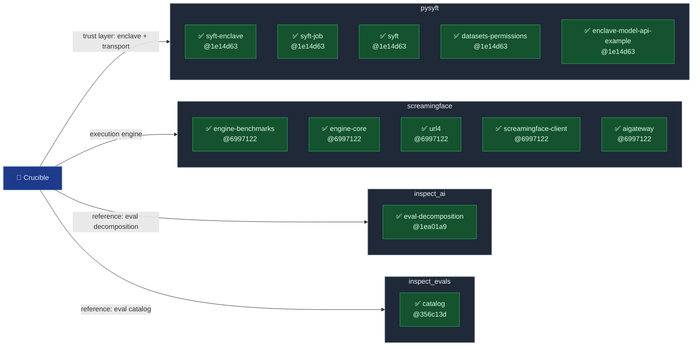

# Upstream knowledge index

Generated by `.claude/skills/update-refs-knowledge` — do not edit by hand. Notes describe the **local tree at the stamped commit**, not the version Crucible pins: check the drift column before trusting a note about pinned behaviour.

Green ✅ = note built (from the commit shown); grey = not built yet.

| Module | Summary | Built from | Local vs pin |
|---|---|---|---|
| [`pysyft/syft-enclave`](pysyft/syft-enclave.md) | Runs a job inside a GCP Confidential Space VM and proves what ran with a Google-signed EAT-JWT; the attested room Crucible's audits execute in. | `1e14d632a9` 2026-09-25 | local 0.1.2 · pin syft-enclave==0.1.2 |
| [`pysyft/syft-job`](pysyft/syft-job.md) | File-drop job submission for SyftBox — a data scientist's code lands in a data owner's inbox as plain files, gets approved, then runs as an unconfined `bash run.sh` subprocess; the kernel sandbox was built only on a side branch that `dev` never merged. | `1e14d632a9` 2026-09-25 | local 0.1.41 · pin syft-job==0.1.41 |
| [`pysyft/syft`](pysyft/syft.md) | The root `syft` client — logs in and syncs files with peers over an untrusted transport (Google Drive today); end-to-end encryption and signing exist but are off unless the caller turns them on; peer keys are trusted on first use and pinned locally. | `1e14d632a9` 2026-09-25 | local 0.10.1 · pin syft==0.10.1 |
| [`pysyft/datasets-permissions`](pysyft/datasets-permissions.md) | Publishing a dataset writes a shareable mock copy and an owner-only private copy, then records read rules in the governing `syft.pub.yaml`; three packages split "rule language and evaluator" (syft-permissions), "friendly API" (syft-perms) and "datasets" (syft-dataset), and none is a rename of another. | `1e14d632a9` 2026-09-25 | local 0.1.16 · pin syft-dataset==0.1.22, syft-perms==0.1.16, syft-permissions==0.1.16 |
| [`pysyft/enclave-model-api-example`](pysyft/enclave-model-api-example.md) | A worked reference for serving a model behind an HTTP API inside a syft-enclave — weights arrive as a syft-datasets private dataset, inference shares port 8080 with attestation, and request logs stay on the enclave's disk unless an approved job reads them out. | `1e14d632a9` 2026-09-25 | local 0.1.0 |
| [`screamingface/engine-benchmarks`](screamingface/engine-benchmarks.md) | An exam-hall metaphor made literal — shared "spine" code seats the candidate, collects answers and totals scores the same way for every benchmark, and a board author writes only the question paper and the one-function marking rule. Registration is packaging-time; an entry-point plugin socket exists, but its only user is a package inside the engine's own wheel. | `69971220fc` 2026-09-25 | local 1.5.0 |
| [`screamingface/engine-core`](screamingface/engine-core.md) | One binary, modes chosen by argv — serve (control plane), run (one url4 eval), worker (durable-queue supervisor) and node (sync surface). `serve --local` fuses run+serve into one process with a loopback-only listener and no Kubernetes/NATS — but its runs still have outbound paths (gateway, Tavily, url4 absolute-URL fetches) a sealed enclave must close. | `69971220fc` 2026-09-25 | local 1.5.0 |
| [`screamingface/url4`](screamingface/url4.md) | A url4 expression IS an address — `(sources)!intent` compiles to a DAG and fans out over GET; `url4 serve` turns one `url4.toml` file into an HTTP node whose routes run operator-written local commands and whose eval endpoint fetches any absolute URL a caller names, so it binds loopback by default and ships no auth of its own. | `69971220fc` 2026-09-25 | local 1.5.1 · pin url4==1.5.1 |
| [`screamingface/screamingface-client`](screamingface/screamingface-client.md) | The published `screamingface` wheel is both the SDK Crucible imports (`sf.Model`, `sf.evaluate`) and a local-runtime launcher that vendors aigateway, scoreboard, screamingface_engine and url4 — `screamingface up` binds all three services to loopback but turns OpenRouter cloud dispatch on, and the SDK's default client falls back to the hosted Engine at fusion.dev.screamingface.ai when no local stack answers. | `69971220fc` 2026-09-25 | local 0.1.1.post9 · pin screamingface==0.1.1.post9 |
| [`screamingface/aigateway`](screamingface/aigateway.md) | The one place model-provider credentials live — a LiteLLM-based OpenAI-shaped gateway with plugin providers (mostly cloud; Ollama and a re-pointed Hugging Face base can stay local), a maintained ingress strip-list for LiteLLM routing/telemetry fields, and an auth-disabled mode that 403s any non-loopback client or Host header. | `69971220fc` 2026-09-25 | local 0.2.1 |
| [`inspect_ai/eval-decomposition`](inspect_ai/eval-decomposition.md) | A Task is Dataset + Solver + Scorer + Metrics; Solver mutates a TaskState (optionally calling the model), Scorer reads that same TaskState plus a string-sequence Target and emits one Score, the harness drops unscored (NaN) Scores, and Metrics reduce the rest to a number — the reference shape Crucible's load→run→grade→aggregate stages are patterned on. | `1ea01a9e1b` 2026-07-30 | local ? |
| [`inspect_evals/catalog`](inspect_evals/catalog.md) | UKGovernmentBEIS's catalog of 129 published Inspect eval packages (246 tasks), self-registered into Inspect via a plugin entry point; the evidence base for Crucible's seam-shape claim. | `356c13d21f` 2026-07-17 | local ? |
