# inspect_ai/eval-decomposition

## Mental model
An Inspect `Task` wires together four independently-typed roles: a `Dataset` of `Sample`s (each an
input + an ideal `target` + optional `metadata`), a `Solver` chain that transforms a `TaskState`
(optionally calling `generate()` to invoke the model), a `Scorer` that reads the finished
`TaskState` plus the sample's `Target` and returns one `Score`, and a list of `Metric`s that reduce
many `Score`s to a number. Between scorer and metric sits the harness, which drops every
NaN-valued ("unscored") `Score` and reports how many it dropped. A `Scorer` never sees the dataset
or other samples, but its `TaskState` carries more than the model's output: the sample's input,
choices, metadata and target ride along. This is the shape Crucible's four stages (load → run →
grade → aggregate) are patterned on: compare it 1:1 against `screamingface/engine-benchmarks`'
spine (`ScoredPath`/`grade_case`), which solves the same decomposition with the answer key in
board-private material instead of on the sample row.

```mermaid
flowchart LR
  dataset["Dataset: Sample<br/>input + target + metadata<br/>dataset/_dataset.py:29-120"]:::data -- "TaskState<br/>input, metadata, target" --> solver["Solver(state, generate)<br/>solver/_solver.py:79-110"]:::stage
  solver -- "TaskState after generate()" --> scorer["Scorer(state, Target)<br/>scorer/_scorer.py:35-62"]:::stage
  target["Target: Sequence[str]<br/>scorer/_target.py:4-28"]:::data -- "answer key" --> scorer
  scorer -- "Score, NaN = unscored" --> harness["harness drops NaN<br/>counts unscored_samples<br/>_eval/task/results.py:396-406"]:::stage
  harness -- "list[SampleScore], scored only" --> metric["⚠️ built-in Metric via value_to_float()<br/>unconvertible value becomes 0.0<br/>log warning only<br/>scorer/_metric.py:234-254"]:::bad
  classDef bad   fill:#7f1d2b,stroke:#e5484d,color:#ffe8ea
  classDef good  fill:#14532d,stroke:#30a46c,color:#dcfce7
  classDef warn  fill:#78350f,stroke:#f5a524,color:#fef3c7
  classDef data  fill:#4c1d95,stroke:#a06ed4,color:#ede9fe
  classDef stage fill:#1e3a8a,stroke:#4a7fd4,color:#dbeafe
  classDef plain fill:#374151,stroke:#9ca3af,color:#f3f4f6
```

## Surface Crucible touches
- **`Sample`** (`dataset/_dataset.py:29-120`) — `input: str | list[ChatMessage]`, `target: str |
  list[str] = ""` ("Ideal target output. May be a literal value or narrative text to be used by a
  model grader", `:82-83`), plus `choices`, `id`, `metadata`, `sandbox`, `files`, `setup`,
  `checkpoint`. The target lives on the dataset row itself, unlike ScreamingFace where the answer
  key is baked into a board-private asset the spine never reads.
- **`TaskState`** (`solver/_task_state.py:140-190`) — one per sample, built from the `Sample` with
  `target=Target(sample.target)` and `metadata=sample.metadata` (`_eval/task/run.py:1011-1020`).
  Scorer-visible accessors include `input`, `choices`, `metadata` (mutable, with a setter,
  `:251-258`), `messages`, `output`, `store`, and `target` (`:423-426`). The same object passes
  through every solver first, so solver code can read the target and metadata too.
- **`Solver` protocol** (`solver/_solver.py:79-110`): `async def __call__(state: TaskState,
  generate: Generate) -> TaskState`. "Solvers may optionally call the `generate()` function to
  create a new state resulting from model generation. Solvers may also do prompt engineering or
  other types of elicitation." A `Task`'s default solver is `generate()` itself — "a normal call to
  the model" (`_eval/task/task.py:86,125`) — so the simplest task is Dataset + a bare model call +
  Scorer, with prompt engineering as optional middleware.
- **`Scorer` protocol** (`scorer/_scorer.py:35-62`): `async def __call__(state: TaskState, target:
  Target) -> Score | None`. The harness calls it as `scorer(state, Target(sample.target))`
  (`_eval/task/run.py:2185-2187`) and stores the result only when it is not `None`
  (`run.py:2192-2195`). The signature gives no handle on the `Dataset`, other `Sample`s, or the
  `Solver`; the current sample's metadata still arrives via `state.metadata`, and built-in scorers
  read it (`scorer/_model.py:185-187`, `scorer/_target_perplexity.py:89-91`).
- **`Target`** (`scorer/_target.py:4-28`) — a `Sequence[str]` wrapper (a single string normalizes
  to a one-element list, `:12`); `.text` concatenates the elements with no separator (`:27-28`).
- **`Score`** (`scorer/_metric.py:89-168`) — `value: Value` (scalar/list/dict), plus optional
  `answer`, `explanation`, `metadata`, and `history: list[ScoreEdit]` (a typed edit log — each
  `ScoreEdit` records `value`/`answer`/`explanation`/`metadata` with `"UNCHANGED"` sentinels for
  untouched fields, `:64-86`). `Score.text`/`as_str`/`as_int`/`as_float`/`as_bool`/`as_list`/
  `as_dict` are typed readers over the same union `value`.
- **`Score.unscored(...)`** (`scorer/_metric.py:107-127`) — "Construct a Score that is preserved but
  excluded from metrics and reducers" by setting `value = NaN`. The built-in model grader returns it
  on a grade-parse failure (`scorer/_model.py:229-240`). This is Inspect's analogue of
  ScreamingFace's `coverage_declare` failure policy: the ungraded sample is excluded from the
  score and its count is published (`scored_samples`/`unscored_samples`,
  `_eval/task/results.py:405-406,470-471`).
- **Metric computation** (`_eval/task/results.py:387-474` list metrics, `:477-587` dict-keyed
  metrics) — before any metric runs, `scorer_for_metrics` filters out scores whose root `value` is
  NaN (`:396-406`), and `scorers_from_metric_dict` skips root-NaN and per-key NaN (`:508-526`). A
  metric only runs when at least one scored sample is left; otherwise the result is NaN
  (`:420-423`, `:541-544`). `call_metric` (`:590`) has no other callers.
- **`Metric` protocol** (`scorer/_metric.py:264-284`; `Metric` = new | deprecated union, `:287`):
  `def __call__(scores: list[SampleScore]) -> Value`. A reduction over the *scored* samples'
  `SampleScore`s (`score` + `sample_id` + `sample_metadata` + `scorer` name,
  `scorer/_metric.py:171-198`) — no handle on the `Dataset` or `Solver`.
- **`value_to_float()`** (`scorer/_metric.py:205-256`) — the default converter for built-in metrics
  (`accuracy`, `mean`, `std`, ... e.g. `scorer/_metrics/accuracy.py:15,36`). Maps numbers, `"C"`/
  `"I"`/`"P"`/`"N"`, and yes/no/true/false strings; anything else — an unrecognized string, a list, a
  dict — logs "Unable to convert value to float" and returns `0.0` (`:252-254`).
- **`ScoreReducer`** (protocol `scorer/_reducer/types.py:6-17`; built-ins
  `scorer/_reducer/reducer.py`, e.g. `mode_score` `:12-38`, `mean_score` `:41-60`) — reduces
  *multiple scores for the same sample* (multi-epoch runs) to one `Score`, orthogonal to `Metric`
  (which reduces across samples). All 7 built-ins (7 `@score_reducer`, 7 `_first_scored(scores)`
  calls in `reducer.py`) return `_nan_score(...)` when no epoch was scored (`_first_scored`
  `:445-450`, `_nan_score` `:541`).
- **`Task`** (`_eval/task/task.py:76-118`) — `dataset`, `setup`, `solver: Solver | Agent |
  list[Solver] = generate()`, `scorer: Scorers | None`, `metrics: list[Metric | dict[str,
  list[Metric]]] | dict[str, list[Metric]] | None` (overrides the scorer's metrics, `:130`). A
  `list[Solver]` is chained (`resolve_solver`, `task.py:568-570`, via `solver/_chain.py`) — the
  multi-stage pattern ScreamingFace's `Pipeline` mirrors on the SDK side.

## Defaults & invariants that matter
- **An unscored sample is recorded and counted, not averaged in.** `Score.unscored()` sets NaN; the
  harness strips root-NaN scores before every metric call and publishes `unscored_samples`
  (`results.py:396-406,471`); every built-in reducer skips NaN epochs. Metrics therefore never see
  a root-NaN score. Crucible's `BenchmarkSpec` grading contract should hold the same invariant: an
  ungraded case is data, not silence.
- **The silent zero lives in value conversion, not in NaN.** A score value the built-in metrics
  can't convert (e.g. `value="maybe"`, or a dict value scored with plain `accuracy()`) becomes
  `0.0` with only a log warning (`scorer/_metric.py:252-254`), dragging the aggregate down with no
  count in the results. A scorer returning `None` is simply not stored (`run.py:2192`). Crucible's
  aggregate stage should reject unconvertible values instead of defaulting them.
- **The Scorer's signature is narrow, its state is not.** The protocol hands a scorer only
  `TaskState` and `Target` — no `Dataset`, no other samples, no `Solver` object. But `TaskState`
  carries the sample's metadata, which a solver can also read or overwrite before scoring. Crucible's
  `grade_case`-equivalent hook should be narrower on purpose, the way
  `screamingface/engine-benchmarks`' spine reads only `row["case"]` out of a board's envelope and
  leaves the rest board-private.
- **`Target` is thin, but it isn't the only answer-key channel.** Rich grading material (rubrics,
  criteria) rides in `Sample.metadata` and reaches the scorer through `state.metadata` — the model
  grader reads its template variables there (`scorer/_model.py:185-187`). The real fork against
  ScreamingFace is *who can see the key*, not how rich it is: in Inspect the target and metadata sit
  on the `TaskState` every solver touches; ScreamingFace keeps grading material in board-private
  assets the run stage never reads.
- **`setup` runs even when the main `solver` is replaced** (docstring `task.py:124`; code
  `_eval/task/run.py:389-407`, `resolve_plan` prepends `task.setup` to whichever solver or plan is
  passed) — swapping solvers for an experiment doesn't skip fixed setup steps.

## Watch list
- `Agent` as an alternative to `Solver` in `Task.solver` (`task.py:86`, converted by `as_solver`,
  `task.py:571-572`) — unexplored; agentic/tool-environment interaction is the axis
  `screamingface/engine-benchmarks`' `InteractionType` flags as "arriving later," so read it once
  Crucible needs multi-turn or tool-using boards.
- `scorer_for_metrics` checks only root NaN (`results.py:400`); a NaN nested in a list-valued score
  is not stripped. Built-in metrics collapse the whole list to `0.0` anyway (above); a custom
  metric would see the nested NaN. Check this path if Crucible emits list-valued scores.
