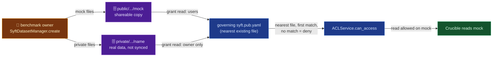

# pysyft/datasets-permissions

## Mental model
A syft datasite is a folder tree, and any folder can hold a `.gitignore`-like access file
(`syft.pub.yaml`). To answer a request, the engine walks from the root toward the path, takes the
nearest file that has rules, and ignores every ancestor file. It uses the first rule in that file
whose pattern matches, most specific first. If none matches, access is denied. The exception is an
ancestor marked `terminal: true`, which stops the walk and overrides deeper files. A "dataset" in
`syft-datasets` is two folders: a mock copy under `public/` that named users may read, and a
private copy under `private/` that only the owner may read. `syft-permissions` is the rule engine,
and `syft-perms` is the wrapper a person imports (`sp.open("data.csv").grant_read_access(...)`).
For Crucible, this is how a private-benchmark owner would publish mock and private splits and gate
who can read the real data.

## Surface Crucible touches
- `SyftDatasetManager.create` (`packages/syft-datasets/src/syft_datasets/dataset_manager.py:56-99`)
  delegates to `create_all` (`:101-135`). That writes mock and private copies in each protocol
  layout the audience (`users`) needs, then runs `_set_new_dataset_permissions` (`:211-230`) for
  each one. With `users=None` (the default) the mock gets no grant, and `SHARE_WITH_ANY` becomes
  `"*"`.
- `set_mock_dataset_permissions` (`permissions.py:6-18`) grants `read` on the mock dir to each
  user. `set_private_dataset_permissions` (`:21-39`) grants `read` on the private dir to the owner
  only. It skips when the private dir is outside the datasite (`:31-36`). `create` never hits that
  skip, because private copies live under `<syftbox>/<owner>/private/syft_datasets/`
  (`config.py:41-42`, `protocolcodecs/v1.py:42-45,62-65`).
- `syft_perms.open(path).grant_read_access/grant_write_access/grant_admin_access/
  explain_permissions` (`packages/syft-perms/src/syft_perms/folder.py:23-65`, usage in
  `packages/syft-perms/README.md`) is the API a Crucible operator script would call to change
  access afterwards.
- `syft_permissions` types: `ACLService` (`engine/service.py:9-49`), `ACLRequest`/`AccessLevel`/
  `User` (`engine/request.py`), `Access` (`spec/access.py:4-16`), `Rule` (`spec/rule.py:8-17`) and
  `RuleSet` (`spec/ruleset.py:11-28`). `syft-perms` imports them. Crucible doesn't call them
  directly.

## Defaults & invariants that matter
- **`syft-perms` and `syft-permissions` are two layers, and neither is a rename.** `syft-perms`
  depends on `syft-permissions` (`packages/syft-perms/pyproject.toml:9-11`, which still declares
  `syft-permissions==0.1.15`). Every `syft_perms` module that touches
  rules imports from `syft_permissions` (`browser.py:5`, `explain.py:7-8`, `file.py:7`,
  `folder.py:6`, `syftperm_context.py:3`, `syftperm_modifier.py:7-13`). Crucible installs both.
- **Distribution name ≠ import name for datasets.** `syft-dataset` (singular,
  `packages/syft-datasets/pyproject.toml:2`) imports as `syft_datasets`.
- **The nearest permission file decides, and a path its rules don't match is denied.**
  `get_nearest_node` returns the deepest file on the path that has rules (`engine/tree.py:45-61`).
  `get_compiled_rule` returns that file's first matching rule, with rules pre-sorted most-specific
  first (`:31-33`, `:63-79`; `engine/utils.py:4-23`). `can_access` returns `False` when no rule
  matches (`service.py:29-31`). The user docs say the same: "no merging" and "access is denied"
  when nothing matches (`packages/syft-permissions/docs/permission-user-docs.md:130-132,202-204`).
  So a folder whose nearest file has any rules can't inherit an ancestor's broader grant, and no
  extra deny-all file is needed to block that.
- **A `terminal: true` ancestor overrides deeper files** (`tree.py:53-54`,
  `permission-user-docs.md:206-221`). A terminal file above a dataset makes the dataset's own
  rules dead. Crucible should check for terminal ancestors before trusting a dataset's rules.
- **A grant edits the governing file, not a new file in the target folder.**
  `add_permission_for_user` finds the nearest existing `syft.pub.yaml` and adds or extends a
  `<relative path>/**` rule there. It creates a file in the target folder only when no governing
  file exists (`packages/syft-perms/src/syft_perms/syftperm_modifier.py:23-31,67-103`). The
  private dir's owner-only rule can therefore live in an ancestor file. It protects the private
  copy because it is the most specific match there.
- **The datasite owner always passes** (`service.py:26-27`; docs `:5`). So
  `set_private_dataset_permissions`'s grant to the owner adds no access. Its effect is a rule
  matching the private tree that names no one else, so everyone else is denied.
- **The private copy stays on the owner's machine under this path.** It sits under the datasite's
  `private/` tree, which syft doesn't sync as a normal file (`syft/sync/utils/path_filters.py:61`),
  and its rule grants no one but the owner. Another party, a Crucible auditor included, gets access
  only through an explicit grant by the owner or through a compute-to-data flow such as
  `pysyft/syft-enclave`.
- **A dataset can exist as several protocol layouts at once.** `create_all` resolves the
  layouts from the named peers' schemas (`dataset_manager.py:130`). "A named peer without an entry
  resolves to the floor" (`:36-39`). A reader should expect several on-disk copies of one logical
  dataset.
- **Writing a permission file needs ADMIN, whatever the letter case of its name.** `ACLService`
  compares `PurePath(request.path).name.casefold()` against `syft.pub.yaml` before escalating to
  ADMIN (`packages/syft-permissions/src/syft_permissions/engine/service.py:33-41`), and the data
  owner's syncer spots permission-file events the same way
  (`syft/sync/sync/datasite_owner_syncer.py:594`). Why it matters: macOS and Windows treat
  `SYFT.PUB.YAML` and `syft.pub.yaml` as one file, so before fix `b38e6fc5c7` (2026-09-16,
  syft-permissions 0.1.16) a peer with plain write access could upload `SYFT.PUB.YAML` and rewrite
  a folder's rules. Peer writes reach this check through `check_write_permission`
  (`datasite_owner_syncer.py:686-689`).

## Watch list
- `syft-perms` still declares `syft-permissions==0.1.15` (`packages/syft-perms/pyproject.toml:10`),
  the version without the case fix. Crucible gets 0.1.16 only because its own `pyproject.toml`
  overrides PySyft's inter-package pins (`[tool.uv] override-dependencies`, working copy
  `pyproject.toml:41-51`). If Crucible drops that override or returns to PyPI pins, check that the
  resolved `syft-permissions` is ≥ 0.1.16, or write grants become admin grants on macOS/Windows
  owners.
- `copy_private_data` is still a `# TODO` (`dataset_manager.py:67`). Crucible may want
  control over whether `create()` copies the private data or references it in place.
