# pysyft/enclave-model-api-example

## Mental model
This package is a demo app built *on top of* `syft-enclave`, not part of its core; the generic
enclave runtime knows nothing about inference (`README.md:7-9`). It answers a question Crucible
has: "how do a model's weights get into a sealed TEE, and how does anyone call the model?" The
model owner publishes the weights as a private `syft-datasets` dataset and shares its private half
with the enclave (`pysyft/datasets-permissions`); the enclave loads them from its synced copy. A
small FastAPI router (`/infer`, `/model-status`) is mounted on the attestation app, so one uvicorn
process serves both on port 8080 while the enclave runner runs as a second process. The callers
are outside the VM: the demo notebook posts to `http://<vm-ip>:8080` over plain HTTP. Every
inference call is logged into the private half of a dataset on the enclave's own datasite. That
half is not synced to Drive, so the way to learn from it is a job that every configured data
owner approves. The approval review is the only guard: an approved job's outputs and logs go back
to its submitter.

```mermaid
flowchart LR
  caller["👤 caller (demo notebook)<br/>outside the VM"]:::plain -- "prompt over plain HTTP<br/>to vm-ip:8080, no auth" --> infer["⚠️ POST /infer<br/>on the attestation port"]:::bad
  weights["🗄️ private weights dataset<br/>shared with the enclave"]:::data -- "load() when use_mock_model=false" --> backend["🤖 MockBackend (default)<br/>or GemmaBackend"]:::stage
  infer -- "prompt" --> backend
  backend -- "prompt + completion record" --> logs["🗄️ private/ log sink<br/>upload_private=False"]:::data
  logs -- "read by an analysis job" --> approval["👤 every data owner<br/>approves the job"]:::warn
  approval -- "job outputs + logs<br/>to the submitter" --> crucible["Crucible: review the job,<br/>the only log guard"]:::good
  classDef bad   fill:#7f1d2b,stroke:#e5484d,color:#ffe8ea
  classDef good  fill:#14532d,stroke:#30a46c,color:#dcfce7
  classDef warn  fill:#78350f,stroke:#f5a524,color:#fef3c7
  classDef data  fill:#4c1d95,stroke:#a06ed4,color:#ede9fe
  classDef stage fill:#1e3a8a,stroke:#4a7fd4,color:#dbeafe
  classDef plain fill:#374151,stroke:#9ca3af,color:#f3f4f6
```

## Surface Crucible touches
- `InferenceSettings` (`src/enclave_model_api/settings.py:18-55`): `use_mock_model: bool = True`
  (`:27-34`, no weights needed to boot); `model_owner` (required, `:35-40`), `model_dataset`
  (default `"gemma3_model"`), `model_size` (`"270m"|"1b"|"4b"`, default `"270m"`), `logs_dataset`
  (default `"inference_logs"`). It shares the `SYFT_ENCLAVE_` env prefix with
  `syft_enclaves.settings.EnclaveSettings` and ignores fields it doesn't own (`extra="ignore"`,
  `:19-25`), so the two settings classes read the same environment without knowing each other.
- `build_router` (`src/enclave_model_api/server.py:23-53`): `POST /infer` (`:28-38`, 503 while
  `not service.loaded`, i.e. weights still syncing) and `GET /model-status` (`:40-51`), which
  reports `use_encryption` so "the notebook reads this to match `login_do(encryption=...)`
  automatically" (`server.py:47-50`). Neither route checks who is calling. `create_app`
  (`server.py:56-67`) is the standalone app for tests; the image mounts the router on the
  attestation app instead (`docker/inference_server.py:9,51`).
- `InferenceService` (`src/enclave_model_api/service.py:20-93`) takes any backend with
  `load(model_size, weights_dir)` and `generate(loaded, prompt, max_new_tokens)` (`service.py:1-6`).
  `infer()` appends a `{prompt, completion, stats}` record for every call (`service.py:84-93`,
  `log_writer.py:17-33`).
- `GemmaBackend.load`/`generate` (`src/enclave_model_api/backend.py:32-45`): the weights dataset
  layout is `<dataset>/tokenizer.model` plus `<dataset>/<checkpoint>/` (`backend.py:8-10`), and
  loading waits until exactly one subdirectory exists (`paths.py:82-95`). It is the only module
  importing the real model deps (`backend.py:1`, `docker/requirements.txt`); the image picks
  `MockBackend` unless `use_mock_model` is false (`docker/inference_server.py:24-33`).
- `ensure_logs_dataset` (`src/enclave_model_api/logs_dataset.py:42-65`), run as the runner's
  `post_init` hook (`__main__.py:74`), creates the logs dataset on the enclave's own datasite. Only
  a synthetic sample record goes into the mock half (`logs_dataset.py:24-39`), shared with
  `users="any"` (`:60`); the private half is the live log sink.

## Defaults & invariants that matter
- **Mock model is the default, including real GCP deploys**: `use_mock_model=True`
  (`settings.py:27-34`), `inference-start ... use_mock="true"` (`Justfile:122`), and `README.md:84-85`
  ("The deployed enclave serves the **mock** model by default"). Crucible must set it false to
  exercise a real model; by default the demo never loads real weights or a GPU.
- **Inference and attestation share one port, 8080, and the callers are outside the VM**:
  `docker/entrypoint.sh:22-24` starts `uvicorn inference_server:app --host 0.0.0.0` in the
  background, with the runner in the foreground (`:28`). `inference-start` tags the VM
  `http-server` (`Justfile:147`), and the README points callers at `http://<vm-ip>:8080`
  (`README.md:84-87,108-113`). The transport is plain HTTP, and grep finds no auth in
  `server.py` or `inference_server.py`. Whether 8080 is reachable depends on the project's firewall
  rules for that tag, which this repo does not create (no `firewall` anywhere in the tree). The
  base `syft-enclave` deploy is outbound-only (`pysyft/syft-enclave`). This example needs an inbound
  8080 rule. Prompts then cross the network unencrypted to the TEE.
- **Private logs stay on the enclave's disk because of one flag plus a sync rule, not by
  construction**: `ensure_logs_dataset` calls `create_dataset(..., upload_private=False)`
  (`logs_dataset.py:55-63`; `False` is also the default at `syft-rds client.py:493`). With `True`,
  the private files are uploaded to a Drive collection (`syft-rds client.py:540-543`); the weights
  take exactly that path (`scripts/run_demo.py:162-170`). Separately, the sync engine does not
  treat `private/` paths as normal-syncable (`syft/sync/utils/path_filters.py:61-62`). The module's
  own words "nothing ever shares it... can never download them" (`logs_dataset.py:1-7`) hold only
  for direct download.
- **An approved job can read the logs out.** Jobs may reference datasets on the enclave's own
  datasite, and approval still needs the configured data owners (`syft-enclave client.py:372-381`).
  The enclave runs approved jobs with `share_outputs_with_submitter=True` and
  `share_logs_with_submitter=True`, and it always forwards outputs to the submitter
  (`syft-enclave client.py:250-254,265-266`). A job that prints or writes log records hands them
  to its submitter. For Crucible, the owners' review of the job code is the only thing between the
  private log and the submitter.
- **Logs don't survive a default reboot**: `fresh_state=True` (`pysyft/syft-enclave`) wipes enclave
  state on boot; `ensure_logs_dataset` keeps old logs only with `fresh_state=false`
  (`logs_dataset.py:45`).
- **Encryption mismatch, per the upstream comment, fails silently at the sync layer, not at the
  API**: `server.py:47-49` ("Data owners must use the SAME setting or peering/sync silently
  fails") is why `/model-status` exposes `use_encryption`. Not checked further here; Crucible
  should detect a mismatch itself rather than wait for `syft` to raise.
- **State reset comes before every demo run**: `just inference-reset` wipes all three datasites "to
  avoid a peer-version handshake race during peering" (`README.md:40-49`). Crucible orchestrating
  a fresh enclave run should plan the same reset, not resume a stale prior run.

## Watch list
- `backend.py` requires DeepMind's `gemma` (JAX) package and is docker-only
  (`docker/requirements.txt`). A different runtime (e.g. HF/vLLM) is not a drop-in swap; implement
  the `InferenceService` backend interface (`load()`/`generate()`, `service.py:1-6`), not
  `GemmaBackend` itself.
