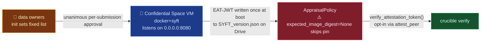

# pysyft/syft-enclave

## Mental model
Three parties keep secrets from each other: a data owner with a private benchmark, a data owner
with a private model, and a data scientist who writes the analysis. `syft-enclave` is the neutral
room where their code meets: a docker container running `syft`, inside a GCP Confidential Space
VM (a TEE: memory encrypted by the CPU; the production image disables SSH and debug). The room
proves what it is with a Google-signed **attestation JWT** that it publishes in its
`SYFT_version.json` on Drive; a party *may* check it with `attest_peer` (nothing calls it
automatically). The enclave runs a job only after **every** configured data owner approved that
exact submission. For Crucible this is the trust root, but `verify_attestation_token` is only
part of `crucible verify`: upstream widens the JWT expiry by ~1 month and checks no verifier-chosen nonce, both of which Crucible must add.

## Surface Crucible touches
- `verify_attestation_token(token, policy, verbose)` (`src/syft_enclaves/attestation.py:154`),
  the check Crucible runs before trusting an enclave. It runs every check before raising, except
  the JWT signature, which fails fast (`attestation.py:195-222`). On failure the full checklist is
  on `AttestationError.result.checks` (`attestation.py:69-71,333-340`); on success it is the
  returned `AttestationResult`. Checks in order: `jwt_signature` (fetches Google's JWKS from
  `CONFIDENTIAL_COMPUTING_CERTS_URL`, `attestation.py:27-30`), `secure_boot` (`secboot is True`,
  `attestation.py:227-238`), `debug_disabled` (`dbgstat == "disabled-since-boot"`,
  `attestation.py:243-252`), `version_match` (`attestation.py:254-284`), `key_binding`
  (`attestation.py:286-290`), `image_digest` (`attestation.py:292-327`).
- `AppraisalPolicy` (`attestation.py:42-63`), the reference values a verifier supplies:
  `expected_image_digest=None` (`:57`), `expected_syft_version=SYFT_VERSION`, the verifier's own
  version (`:59`), `expected_key_fingerprint=None` (`:63`).
- `EnclaveJobClient` (`src/syft_enclaves/enclave_job_client.py:9`) wraps `syft_job`'s
  `JobClient`. Its one real override is `submit_python_job` (`enclave_job_client.py:48-75`),
  which after the base submit writes `job_type="enclave"`, the `datasets` map and
  `share_results_with_do` into `config.yaml`. The other members delegate to `syft_job`; see
  `pysyft/syft-job`.
- `SyftEnclaveClient` (`src/syft_enclaves/client.py:42`) is the client every party uses:
  `login_do`/`login_ds` return it (`login.py:76,102`) and the enclave builds it with
  `for_enclave` (`client.py:497`). Party side: `attest_peer` (`client.py:87`), `approve_job`/
  `reject_job` (`client.py:308,316`). Enclave side: `receive_jobs`,
  `run_jobs` (`client.py:238`), `distribute_results` (`client.py:256`), driven every poll by
  `EnclaveRunner.tick` (`runner.py:77-90`).
- `EnclaveJobInfo.status` (`src/syft_enclaves/enclave_job_info.py:104-117`), the approval state
  Crucible reads to know if a job can run.

## Defaults & invariants that matter
- **`expected_image_digest=None` skips the digest check** (`attestation.py:57`, checked at
  `attestation.py:299-306`, recorded as `passed=None`, "skipped", not failed). Crucible must pass a
  digest it confirmed itself; with none, each owner's approval covers whatever image is running.
- **`attest_peer` returns `None`, not an error, when the peer has no version file or no token**
  (`client.py:119-132`). With `require_tee=False` as the default (`settings.py:70-76`) the runner
  boots without a TEE and publishes no token (`runner.py:120-130`). Both deploy paths set
  `REQUIRE_TEE=true` (`terraform/vm.tf:33`, `Justfile:272`). Crucible must treat `None` as failed.
- **`version_match` is skipped when the token carries no version nonce** (`attestation.py:264-270`)
  and fails when the verifier runs a different `syft` than the enclave (default at `:59`).
- **`image_digest` beats `image_tag` in both deploy paths**: Terraform
  (`terraform/vm.tf:12-13`; `terraform/variables.tf:88-96` checks `sha256:<64-hex>`) and the
  `just start`/`start-debug` recipes (`Justfile:219-229,284-294`). `image_tag` defaults to `latest`
  (`variables.tf:82-86`, `Justfile:3`). Crucible's deploy must set `image_digest`.
- **JWT expiry is stretched ~1 month past the ~30-minute Google lifetime**
  (`JWT_EXPIRY_GRACE_SECONDS`, `attestation.py:32-39`) because the enclave writes its token once,
  in `_on_attesting` at boot (`runner.py:118-147`), and a `TODO` says it does not refresh it yet.
  A month-old boot token still verifies. The published token has no verifier nonce. The only
  nonce-bearing path is `GET /attestation?nonce=` on port 8080
  (`docker/attestation_server.py:154-201`), which puts the no-key placeholder in the key slot.
- **Approval is per exact submission, keyed by content hash**: `submission_hash()`
  (`enclave_job_info.py:67-81`) hashes every file of the submission except permission files;
  `_approves()` (`enclave_job_info.py:182-187`) requires the stored hash to match the current one,
  so a code change voids earlier approvals until each owner approves again. The enclave applies
  this only to jobs it runs itself (`client.py:191-200`); a data owner's client shows the status
  of the files it holds (`enclave_job_info.py:110-117`).
- **Unanimity is against a fixed data-owner list set at `init`**: `README.md:37`.
  `EnclaveSettings.data_owners` (`settings.py:38-44`) is read from `SYFT_ENCLAVE_DATA_OWNERS`
  into frozen settings. Every job is forwarded to those owners as approvers
  (`client.py:377-381`). Changing owners means re-`init` and redeploy.
- **A missing or rejected approval is not consent**:
  `_status_from_required_approvers` (`enclave_job_info.py:119-133`) counts a party with no
  readable file as not approved, lets any rejection win before the approval check, and keeps a
  job with an empty approver list PENDING.
- **A job without `datasets` is never distributed** (`client.py:364-365`): `_try_distribute_job`
  returns early, so it never reaches the owners.
- **`fresh_state=True` by default** (`settings.py:81-89`, `runner.py:110-116`) wipes local and
  Drive enclave state on boot; peers must re-`add_peer`. Crucible must choose it per redeploy.
- **Private dataset files are write-once on the receiving side**:
  `make_private_dataset_immutability_filter` (`immutability.py:21-52`) is installed on the
  watcher syncer of every client built by `from_config` (`client.py:488-492`). It drops an
  incoming overwrite or delete of an existing `<email>/private/syft_datasets/...` file with a
  warning in the receiver's log. Republishing a corrected private benchmark to the same path gives
  the publisher no error, and the enclave keeps the first copy.
- **GPU deploys use flex-start, not on-demand**: `terraform/vm.tf:15-23,70-95`. The only GPU
  profile is `a3-highgpu-1g` (1× H100, Intel TDX); the CPU default is `n2d-standard-2` (AMD SEV).
  The VM queues for capacity, then deletes itself after `max_run_duration_seconds` (default 2 days,
  max 7, `variables.tf:61-69`; `docs/terraform.md:54-61`). The deploy's default job timeout is 30
  days (`variables.tf:121-126`, `Justfile:14`), so on GPU the VM deletion ends a long job, not the
  timeout. A GPU audit must fit the window.
- **The container listens on `0.0.0.0:8080`**: `docker/entrypoint.sh:24-26` starts uvicorn with
  `/`, `/health` and `/attestation` (`attestation_server.py:134-155`); `Dockerfile:71` exposes
  8080. The deploys add no firewall rule or network tag (`terraform/vm.tf:105-110`; no firewall
  in `Justfile`), and outputs label the IP "Outbound-only" (`terraform/outputs.tf:38`). Who can
  reach 8080 therefore depends on the VPC's existing rules; not checked here. The debug image
  enables SSH (`README.md:53`, `variables.tf:111`) and `just attest` curls
  `localhost:8080/attestation` over it (`Justfile:430-441`). Peers normally read the token from
  Drive, not from the port.
- **Container logs can reach the operator.** `Dockerfile:65` sets
  `tee.launch_policy.log_redirect=always`. By Confidential Space's launch-policy docs (not checked
  in this repo), the operator can then redirect container logs even on the production image.
  Anything a job prints may leave the TEE that way.

## Watch list
- Attestation-token refresh (`attestation.py:37-38` TODO): once the enclave refreshes its token
  during the run, `JWT_EXPIRY_GRACE_SECONDS` should shrink back toward ~30 minutes. Re-check
  Crucible's freshness assumption then.
- `key_binding` is skipped unless `expected_key_fingerprint` is set.
  `attest_peer` sets it only when the calling client encrypts (`client.py:147-148`), and
  `login_do`/`login_ds` default to `encryption=False` (`login.py:82,108`). Crucible's parties must
  log in with `encryption=True`, or the check never runs.
- The docstring of `verify_attestation_token` still says the default policy pins a "module-level
  pinned digest" (`attestation.py:175`); the code pins none (`:57`). Trust the code.
