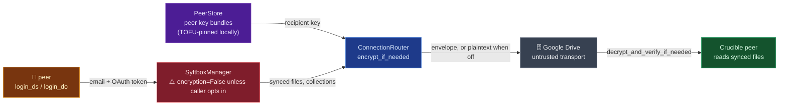

# pysyft/syft

## Mental model
`syft` treats Google Drive as a shared bulletin board that anyone might read or tamper with.
`login_ds`/`login_do` start a `SyftboxManager` that syncs a local folder against Drive, and every
file it syncs goes through one `ConnectionRouter`. The router can wrap bytes in a
`syft_crypto_python` envelope (encrypted to the recipient, signed by the sender), but only when
encryption was switched on when the client was built. The plain `syft.login*` path never switches
it on. Think of it as a sealed-envelope service where sealing is an opt-in setting at the counter.
For Crucible this is the wire under `syft-job` and `syft-enclave` (job code, approvals, results).
Crucible's claim that the transport doesn't need to be trusted holds only on the paths that turn
encryption on, and even there a peer's key is trusted the first time it is seen.

## Surface Crucible touches
- `login`/`login_ds`/`login_do` (`syft/sync/login.py:95-169`): `login` is an alias for
  `login_ds` (`:95-109`). None of the three takes an `encryption` argument. They build
  `SyftboxManager.for_colab`/`for_jupyter` with its default `encryption=False`
  (`syft/sync/syftbox_manager.py:584-633`). `_verify_token_matches_email` (`login.py:15-23`)
  refuses a login whose OAuth token authenticates a different account than `email`.
- `syft_enclaves.login_do`/`login_ds` (`packages/syft-enclave/src/syft_enclaves/login.py:76-127`)
  is a separate wrapper that does accept `encryption`, and it also defaults to `False` (`:82`,
  `:108`). The `syft-enclave` README line "`login_do(encryption=False)`"
  (`packages/syft-enclave/README.md:61`) refers to this wrapper, not to `syft.login_do`.
- `ConnectionRouter` (`syft/sync/connections/connection_router.py`) is where peer-directed
  payloads meet the crypto. Messages are encrypted in `encrypt_if_needed` (`:150`, `:176`) and
  checked in `decrypt_and_verify_if_needed` (`:166`, `:191`). Collection uploads are encrypted only
  when a recipient is named (`:359-374`), and collection downloads go through
  `decrypt_dataset_if_needed` (`:394-406`, `:445-449`). It is the seam a Crucible-specific
  transport would replace. The crypto sits in `PeerStore` above it.
- `PeerStore.encrypt`/`decrypt`/`verify_message` (`syft/sync/peers/peer_store.py:326-349`) are thin
  wrappers over `syft_crypto_python` (`syc.encrypt_message`, `syc.decrypt_message`,
  `syc.verify_envelope_signature`, `syc.parse_envelope`). The cryptography lives in that external
  package.
- `PeerStore.encrypt_for_self_if_needed`/`decrypt_and_verify_for_self_if_needed`
  (`peer_store.py:367-378`, gated on `use_encryption and has_my_keys()`) encrypt the owner's own
  Drive-side event log, checkpoints and rolling state (`connection_router.py:214,223,499,543,584`;
  `syft/sync/sync/datasite_owner_syncer.py:199`). They don't touch local files.
- `parse_and_validate_bundle`/`bundle_fingerprint` (`syft/sync/peers/key_bundle.py:107-134`,
  `:85-87`) check a bundle's signatures and that its `did:syft:<email>` id matches
  the peer.

## Defaults & invariants that matter
- **Encryption is off unless a caller turns it on.** The defaults are `PeerStore.use_encryption =
  False` (`peer_store.py:66`), `Peer.use_encryption = False` (`peer.py:22`) and `encryption: bool =
  False` on `SyftboxManagerConfig.for_colab`/`for_jupyter` (`syftbox_manager.py:128,207`) and
  `SyftboxManager.for_colab`/`for_jupyter` (`:589,616`). With it off, `encrypt_if_needed` and
  `decrypt_and_verify_if_needed` return the bytes unchanged (`peer_store.py:102-111`). Files on
  Drive are then plaintext and unsigned. There are three ways to turn it on: pass `encryption=True`
  to `SyftboxManager.for_*`, pass it to `syft_enclaves.login_*`, or run the enclave runner, whose
  settings default `use_encryption=True` (`packages/syft-enclave/src/syft_enclaves/settings.py:90-91`,
  `__main__.py:54`).
- **With encryption on, some bytes still cross Drive in the clear.** An "any"-shared collection
  has no named recipient, so it uploads plaintext (`connection_router.py:367-372`). The version
  file (`:418-431`) and key bundles (`:320-333`) are written without an encryption call, and Drive
  folder and file names are visible metadata. Crucible must not read "encryption on" as "nothing
  readable on Drive".
- **Downloaded dataset files tolerate plaintext.** `decrypt_dataset_if_needed`
  (`peer_store.py:121-133`) passes non-envelope bytes through without verifying them ("Dataset
  collections (public mock previews) are uploaded unencrypted"). The signature check therefore
  covers only bytes that arrive as envelopes. Plaintext substituted on Drive passes unverified.
- **The encryption flag is per client, not per peer.** `set_peer`/`add_peer`/`set_peers` copy the
  store's flag onto every peer (`peer_store.py:139-157`), so a client encrypts to all its peers or
  to none. Both parties have to agree. The `syft-enclave` README says debug enclaves run with
  encryption off, so data-owner clients must match (`README.md:61`).
- **Peer keys are trust-on-first-use (TOFU): the first key seen for an email is remembered, and a
  later different key is refused.** The first valid bundle seen for an email is pinned in the
  local `private/crypto_keys.json`, not on Drive (`peer_store.py:53-61`). A differing Drive copy is warned about and dropped (`_keep_pinned_bundle`, `:159-185`). An
  explicit `set_peer_bundle` with a new identity key raises `PeerKeyChangedError` unless
  `allow_key_change=True` (`:294-316`). `key_bundle.py`'s own caveat: "Neither check proves the
  identity key belongs to the person. Only comparing fingerprints out of band does"
  (`key_bundle.py:12-13`). So a bundle swapped on Drive *before* first contact is still accepted.
- **Version compatibility is same major.minor, and data owners also skip patch-different peers by
  default.** `compatibility_status_with` (`syft/sync/version/version_info.py:62-78`) returns
  PATCH_DIFF for the same major.minor and INCOMPATIBLE otherwise. INCOMPATIBLE and UNKNOWN peers
  are skipped unless `force_ignore_peer_version`/`ignore_peer_version` is set
  (`version/peer_manager.py:442-460`). `skip_peer_on_patch_version_diff` defaults to `has_do_role`
  (`:126-128`, `:142-145`), so a data owner on 0.10.0 skips a 0.10.1 peer unless the
  caller overrides it. `MIN_SUPPORTED_SYFT_VERSION = "0.10.0"` (`syft/version.py:16`) is written
  into the version file (`version_info.py:129`). The comparison doesn't use it.
- **The package was renamed from `syft-client` to `syft` at 0.10.0** (`syft/version.py:14-15`,
  `syft/__init__.py:2`). `syft-client` in Crucible's docs or lockfile means this same package
  before 0.10.0. A `syft-client` 0.1.x peer is major/minor-incompatible and skipped by default.
- **A major/minor mismatch at login prompts before the client starts**
  (`handle_potential_version_mismatches_on_login`, `login_utils.py:72-110`). The default (choice
  1) keeps the data, and `_init_client_login` prints that the repair (adopting earlier-version Drive
  folders, rebuilding caches) runs on this sync or on the first `sync()` (`login.py:47-60`). With
  no terminal attached it takes choice 1 without prompting (`login_utils.py:136-146`). Before
  0.10.1, choice 1 wiped the local SyftBox and its keys and blocked on `input()`.

## Watch list
- The key-trust code (`key_bundle.py`, TOFU pin, `trust_peer_key`) is on `dev` and absent from
  the 0.10.0 release. Crucible has it only because it installs `dev` HEAD; if it returns to a PyPI
  release, confirm that release ships `key_bundle.py`.
- Check whether any Crucible-facing flow shows fingerprints to a human for out-of-band comparison.
  `syft-enclave` reads an `expected_key_fingerprint` from its policy (`client.py:147`); see
  the `pysyft/syft-enclave` note.
- `gdrive_transport.py` (2476 lines) was not read. The Drive folder
  layout, sharing ACLs and concurrent-write behaviour live there.
