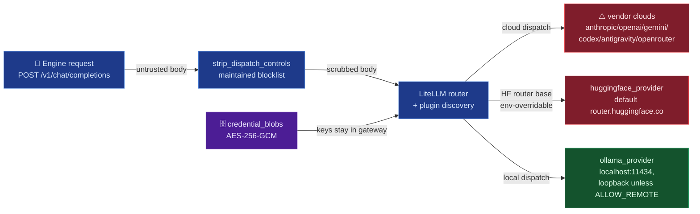

# screamingface/aigateway

## Mental model
Every model call the Engine makes goes through one door: `POST /v1/chat/completions`, OpenAI-shaped
regardless of which real provider answers it. Behind that door, `aigateway` is a credential vault
plus a router — provider concerns (OAuth, refresh, response shaping) live in self-contained plugins
under `plugins/`, discovered automatically by a `PLUGIN` attribute, and dispatch goes through
LiteLLM. Because a chat request body is untrusted input that LiteLLM would interpret as
routing/credential/telemetry control fields (`api_base`, `callbacks`, `langfuse_host`, ...), the
chat route scrubs the body at ingress before profile lookup, cache planning, or credentials. For
Crucible, this package answers "where can model calls go without leaving the enclave" (Ollama, or
Hugging Face with its router base re-pointed; everything else is a vendor cloud) and "what stops a
candidate's request body from becoming an exfiltration channel" (a maintained strip-list, not an
allowlist).

## Surface Crucible touches
- **Registered provider plugins** (`README.md:7-8`, `plugins/*/plugin.py` `PLUGIN = ...`) —
  `anthropic_provider`, `antigravity_provider`, `codex_provider`, `gemini_provider`,
  `huggingface_provider`, `ollama_provider`, `openrouter_provider`, `openai_provider` (8 provider
  directories plus `taxonomy`). The README names 7 and says there is no first-class OpenAI Platform
  provider (`README.md:16-19`), but `openai_provider` exists and targets
  `OFFICIAL_API_BASE = "https://api.openai.com/v1"` (`plugins/openai_provider/settings.py:31`).
- **Which providers can point at a local server** (checked every `plugins/*/settings.py` for a
  base-URL field, plus Ollama's `discovery.py`):
  - **Ollama** — `DEFAULT_OLLAMA_HOST = "http://localhost:11434"` (`ollama_provider/discovery.py:15`),
    overridable by `AIGW_OLLAMA_HOST` or `OLLAMA_API_BASE` (`:40-42`). A non-loopback host falls
    back to the default unless `AIGW_OLLAMA_ALLOW_REMOTE=1` (`:84-121`), so a model server in a
    sibling container needs that flag.
  - **Hugging Face** — `router_api_base` defaults to `https://router.huggingface.co/v1`
    (`huggingface_provider/settings.py:39,192`) and is settable via
    `AIGW_HUGGINGFACE_ROUTER_API_BASE` (env prefix `:186`); the plugin stamps it as `api_base` on
    every model and chat body (`plugin.py:85,236`). It can point at a local OpenAI-compatible
    server, with no loopback check, and the HF credential goes wherever it points. A non-official
    base makes the plugin decline the global response cache (`runtime_guard.py:201-232`).
  - **Antigravity** — `code_assist_endpoint`/`code_assist_fallback_endpoint` are settings fields
    (`antigravity_provider/settings.py:102-103`, env prefix `AIGW_ANTIGRAVITY_`) but speak the
    Google Code Assist protocol, not a generic local server.
  - **Anthropic, Codex, Gemini, OpenRouter, OpenAI** — no base-URL setting; they dispatch to the
    vendor's API.
- **`Settings`** (`config.py:13-38`) — `host: str = "127.0.0.1"` (`:21`), `port: int = 9105`
  (`:22`), `auth_mode: AuthMode = "jwt"` (`:38`, default **on**; `auth_enabled: bool = True` at
  `:35` is the legacy alias that seeds it). `_reconcile_auth_mode` (`config.py:236-258`) refuses
  `AIGATEWAY_AUTH_ENABLED=false` combined with an explicit conflicting `AIGW_AUTH_MODE`. Settings
  also read a `.env` in the working directory (`config.py:16`). `screamingface up` sets
  `auth_mode="disabled"` explicitly (see `screamingface/screamingface-client`).
- **`strip_dispatch_controls`** (`core/request_hardening.py:167-185`) — called on the
  `/v1/chat/completions` body after shape validation and before profile lookup, cache planning, or
  credential access (`routes/chat.py:262-270`), and again in `openai_provider/plugin.py:166`.
  Removes `DISPATCH_CONTROL_FIELDS` (`request_hardening.py:99-164`): routing/credential vectors
  (`api_key`, `api_base`, `base_url`, `headers`, `extra_headers`, `model_list`, `fallbacks`,
  `custom_llm_provider`, `ssl_verify`, mock/retry/cooldown controls, …) plus the telemetry-redirect
  fields in `_CALLBACK_DYNAMIC_FIELDS` (`request_hardening.py:28-89`) — Langfuse, LangSmith,
  Humanloop, Arize, PostHog, Braintrust, Slack webhook, Lunary, Datadog (`dd_*`), New Relic.
  Callback fields are also stripped from a nested
  `metadata` mapping (`request_hardening.py:170-184`) since LiteLLM resolves callback credentials
  from either. Pinned by `tests/unit/core/test_request_hardening.py:245`
  (`test_litellm_dynamic_callback_parameter_set_is_covered`).
- **Secrets at rest** (`README.md:28-53`) — `credential_blobs` (OAuth tokens, JWT secret) are
  AES-256-GCM encrypted via `SecretStoreMixin` (`core/secrets/mixin.py:14`); ciphertext is
  `v1:<nonce-b64>:<ciphertext-b64>`. `AIGATEWAY_SECRET_KEY` is required for multi-worker/hosted
  deployments; a single-worker local run generates one, persists it in the same database, and logs
  a warning.
- **`GET /v1/model-parameters`** (`README.md:113-124`; `routes/model_parameters.py:197`) — the
  per-model contract (enabled optional params, JSON Schema, cache behavior), `private, no-store`
  (`:73`). `context.execution_access` (`configured`/`missing`, configuration only).

## Defaults & invariants that matter
- **The gateway is the credential boundary**: "the Engine and Client never see raw keys"
  (`README.md:11-12`). Crucible's threat model should treat aigateway, not the Engine, as the
  holder of provider secrets.
- **Zero egress is not a default; it's a configuration.** Options are Ollama (loopback, or remote
  with `AIGW_OLLAMA_ALLOW_REMOTE=1`), Hugging Face with `AIGW_HUGGINGFACE_ROUTER_API_BASE` pointed
  inside the enclave, or a new plugin (the `PLUGIN`-attribute convention makes that a
  self-contained addition, `README.md:20-23`). OpenRouter ships disabled
  (`openrouter_provider/settings.py:216`) but `screamingface up` enables it. Other cloud plugins
  dispatch once a credential/profile for them exists; this note did not trace each plugin's
  enable gate beyond OpenRouter's.
- **Model discovery dials public catalogs by default.** `discovery_enabled` defaults to `True`
  (`config.py:200`, `AIGW_DISCOVERY_ENABLED`); it builds an httpx discovery runtime whose docstring
  says it re-dials "a public catalog" on contract reads, TTL-cached (`main.py:317-346`), e.g.
  `https://openrouter.ai/api/v1/models` (`openrouter_provider/discovery.py:49-51`). A zero-egress
  deployment sets `AIGW_DISCOVERY_ENABLED=false`.
- **Auth-disabled mode is loopback-enforced, not just loopback-bound.** With
  `auth_mode="disabled"`, `create_app` installs `AuthDisabledLocalOnlyMiddleware`
  (`main.py:381-385`), which returns `403` unless the client IP is loopback **and** the `Host`
  header is `localhost` or a loopback IP (`core/auth/local_only.py:48-59`). Protected endpoints
  then run as a fixed anonymous account (`README.md:89-93`). What it doesn't stop: any process on
  the same host (or a same-host reverse proxy forwarding a loopback `Host`) is fully trusted.
- **v1 ships no application-level rate limiting on `/v1/auth/login`** — "you MUST front it with
  rate-limiting" if exposed publicly (`README.md:105-107`).
- **The request-hardening strip-list is a maintained blocklist, not an allowlist** — LiteLLM
  upgrades have added dynamic-callback fields (Datadog at 1.95, New Relic/Langfuse environment at
  1.100) that were added after the fact (`request_hardening.py:51-75`). Crucible bumping LiteLLM
  must re-check the list against `litellm._supported_callback_params`.
- **Google Code Assist quirk**: Antigravity must send `ideType="ANTIGRAVITY"`,
  `pluginType="GEMINI"` (`README.md:135-138`). A landmine only if anyone touches that plugin.

## Watch list
- `openai_provider`'s `runtime_guard.py` (OME-884) — `certifies_global_cache_participation`
  (`:256`) gates the shared exact-request cache on no unsafe ambient LiteLLM global state; read it
  directly if Crucible relies on that provider's response caching.
- LiteLLM's own outbound behaviour (telemetry, remote model-cost map fetch) was not checked here —
  `litellm` is not installed in Crucible's `.venv` (it depends on bare `screamingface`, no
  `[runtime]` extra); verify against the runtime extra's `litellm==1.98.0`
  (`packages/screamingface/pyproject.toml:58`) before claiming the gateway process is egress-free.
- `core/provider_access/` decides which profile and credential slot a call uses (with migration
  `0012_provider_credential_slots.py`); not traced here — read it before Crucible configures
  provider profiles or credential slots for the enclave.
