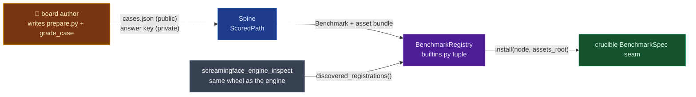

# screamingface/engine-benchmarks

## Mental model
Every benchmark ("board") is an exam. The **spine** (`benchmarks/spine/`) is the exam
hall's shared machinery — it seats the candidate, collects the answer sheets, files results, and
totals the score, identically for every board. A board author brings three things: the question
paper (a dataset → `cases.json` mapping, prepared ahead of any run, never at request time), the
marking rule for one answer (`grade_case`, from a graded row to a score), and a cover sheet
(`BenchmarkDeclaration` — `failure_policy`, `interaction`, `difficulty`) a reviewer can read off
the manifest. `BenchmarkRegistry` holds one immutable, validated set of boards per Engine
deployment; `BUILTIN_DEPLOYMENT` in `builtins.py` is that set — a hand-edited tuple plus whatever
the entry-point socket discovers. For Crucible, this package is the shape `BenchmarkSpec` has to
fit: what a board owns vs. what the spine refuses to let it touch.

## Surface Crucible touches
- **The spine, `benchmarks/spine/`** — `ScoredPath` (`spine/scored.py:170`)
  bundles a board's hooks: `reader: RowReader`, `grade_case: GradeCase`, `failure_messages`,
  `method` (a free string), `grading_failure_code`, `missing_material_code` (default
  `"missing_rubric_asset"`, `:219`). `GradeRequest`/`CaseGradeOutcome` (`spine/scored.py:82,103`)
  are a marking rule's input/output — an outcome carries `score`, `metrics`, `checks`; `Check` /
  `Evidence` are wire models in `benchmarks/contract.py:151,175`. `RowReader` (`spine/rows.py:100`)
  decodes the board's opaque evaluation-row envelope; the one sub-key the spine reads is
  `row["case"]` (candidate fields `status`, `output`, `finish_reason`, `refusal`, `execution`,
  `operations`, `metadata`) — everything else is board-private
  (`docs/adding-a-benchmark-manually.md:93-98`).
- **`grade_case`, the marking rule** — `type GradeCase = Callable[[GradeRequest],
  Awaitable[CaseGradeOutcome]]` (`spine/scored.py:122`). A rubric board doesn't write one:
  `rubric_grade_case(case_score=..., judge_producer_id=...)` (`spine/rubric.py:53`) is a shared
  factory that owns the two rubric failure codes (`"incomplete_verdicts"`, `"no_positive_points"`,
  `:85`) and parses judge replies through one shared parser, `parse_verdict`
  (`spine/verdict.py:121`).
- **`failure_policy`** (`benchmarks/definition.py:21-34`, `FailurePolicy =
  Literal["withhold", "coverage_declare"]`) — `withhold`: an ungraded Case counts against the
  candidate, score = earned/all, coverage always reads 100% (an outage makes the model look
  worse). `coverage_declare`: an ungraded Case is excluded, score = earned/graded, and a visible
  "scored 124 of 157" coverage figure is published. **Required, no default** — `Benchmark.declaration`
  has no default (`definition.py:190-192`, OME-1039); the authoring guide calls a defaulted one "a
  policy nobody can approve" (`docs/adding-a-benchmark-manually.md:39-40`). Every
  `failure_policy=` in the tree (6 boards + the inspect plugin) is `coverage_declare`.
- **`BenchmarkRegistry`** (`benchmarks/registry.py:29-67`) — `__slots__ = ("_benchmarks",)`, built
  once from an `Iterable[Benchmark]` (duplicate ids raise, `:38`), stored in a `MappingProxyType`
  (`:40`) — no runtime `.add()`. `.install(node, assets_root)` (`registry.py:52-67`) calls every
  `Benchmark.install`, renders every board's protocol, and raises if a referenced route was never
  registered — the guide's "a missing route fails at startup, not mid-run"
  (`docs/adding-a-benchmark-manually.md:199-200`).
- **`BenchmarkAssetBundle` / `BenchmarkRegistration` / `BenchmarkDeployment`**
  (`benchmarks/deployment.py:35,49,66`) — a registration pairs a runtime `Benchmark` with a bundle;
  `asset_bundle` has **no default** — "omission cannot masquerade as an assetless protocol"
  (`:52-53`). DRACO and DRACO-3PASS share one bundle (`builtins.py:99-100`).
- **`discovered_registrations` — the plugin socket**
  (`benchmarks/discovery.py:30-32,41-74`) — entry-point group
  `"screamingface_engine.benchmark_deployments"`; each entry point resolves to a zero-arg callable
  returning `BenchmarkRegistration`s, loaded in name-sorted order, raising `TypeError` on anything
  else (`:68-72`). Core discovery names no plugin; "a plugin whose optional dependencies are
  absent contributes an EMPTY iterable itself" (`:12-15`). Composition:
  `BUILTIN_DEPLOYMENT = BenchmarkDeployment((*BUILTIN_REGISTRATIONS, *discovered_registrations()))`
  (`builtins.py:117`).
- **The socket's only user ships inside the engine's own wheel.** The engine's `pyproject.toml`
  declares the entry point itself (`:94-95`, `inspect = "screamingface_engine_inspect.deployment:registrations"`)
  and builds both packages into one wheel (`:101-102`); `screamingface_engine_inspect/deployment.py:3-4`
  says so: "The plugin ships in the same wheel as the engine, so the entry point ALWAYS exists".
  Its boards appear only when the `inspect` extra is installed (`__init__.py:9-12`). A `git grep`
  finds no other distribution in the repo declaring the group, so no separate wheel exercises the
  socket yet.
- **In the engine Crucible actually runs, the socket is empty.** Crucible gets the engine vendored
  inside the `screamingface` client wheel, whose build hook copies `screamingface_engine` only
  (`packages/screamingface/scripts/runtime_build_hook.py:55-57`) — no
  `screamingface_engine_inspect`. The installed `screamingface-0.1.1.post9.dist-info/entry_points.txt`
  declares only the `screamingface` console script, and no other installed distribution declares
  the group, so `discovered_registrations()` returns nothing and the inspect boards never appear.
  The flip side: discovery reads the interpreter's installed metadata
  (`entry_points(group=group)`, `discovery.py:32,38`), so any installed distribution — Crucible
  itself included — can plug a board in by declaring that group, with no engine source change.
- **`BenchmarkInstaller`** (`benchmarks/definition.py:19`) is a **type alias**,
  `Callable[[Url4Node, Path], None]` — the function a `Benchmark` supplies to mount its private
  routes/assets onto the shared node. `_no_routes` (`definition.py:82`) is the default no-op.
- **`CheckSurface`** (`benchmarks/definition.py:86-116`) — `check_route`, `feedback_intent`,
  `expected_check_cost: Literal["free","paid"]`. An **absent** surface means the benchmark cannot
  check mid-run, so a client's preflight refuses a loop recipe "before any money moves" — for MCQ
  boards that refusal blocks a pass/fail elimination attack.
- **`BenchmarkOrigin`** (`benchmarks/definition.py:55-60`) — `Literal["screamingface",
  "inspect_evals"]`, a `Benchmark.origin` field defaulting to `"screamingface"`; the import lane
  passes `"inspect_evals"` explicitly (`definition.py:204-209`, OME-1112).

## Defaults & invariants that matter
- **Registration is packaging-time and public**: it happens at process composition (module
  import), never per request. The built-in boards are a flat, hand-edited tuple in `builtins.py`
  ("no entry points, no discovery" for that path, `docs/adding-a-benchmark-manually.md:267`). A
  second path exists — a distribution declaring an entry point in
  `screamingface_engine.benchmark_deployments` contributes boards core never names — but it also
  composes at process start, so there is no runtime registration API.
  That socket is the likeliest seam for a Crucible-owned private board, and nothing has proven it
  from outside the engine's wheel yet.
- **The dataset row (`cases.json`) is public; the evaluation row is a board-owned envelope** the
  spine never inspects beyond `row["case"]` (`docs/adding-a-benchmark-manually.md:86-98`).
  The guide says the answer key / rubric "is read only by `runtime.py` and
  `aggregate.py`" (`:72-74`) — a convention per board, not checked here board by board.
- **Assets are prepared before any run, never at request time.** Images bake them in
  `Dockerfile.benchmark` (`prepare` stage runs `-m screamingface_engine.benchmarks.prepare --root
  /opt/benchmarks`, `:79`, copied into the runtime image at `:89`); the client CLI can also prepare
  them on disk (`screamingface prepare <benchmark>`, `packages/screamingface/src/screamingface/_runtime/cli.py:28,65`)
  and `URL4_BENCHMARK_ASSETS` names the root (`registry.py:18`). There is no "upload dataset, then
  register" runtime flow.
- **`interaction` and `difficulty` are hand-declared, not measured**
  (`benchmarks/definition.py:35-54`) — `multi_turn` changes both the cost shape (N invocations per
  Case) and what a Fusion entrant is asked to do; `DifficultyTier` is assigned by the
  author/importer at PR review, not computed from score distributions.
- **One activity vocabulary for every board, by convention not by type**: `CASE_LOADING`,
  `ANSWERING`, `GRADING`, `AGGREGATION` — "Do not introduce board-specific stage names"
  (`docs/adding-a-benchmark-manually.md:213-215`). Activity is best-effort; "scores and reports
  must never depend on its delivery" (`:262-263`).
- **A board never edits another board or the spine** — "if you have to, the spine failed its
  deletion test and that is a bug to file, not a pattern to copy"
  (`docs/adding-a-benchmark-manually.md:13-15`).

## Watch list
- `discovered_registrations` (OME-1115) — re-check on every refresh whether a separately-packaged
  wheel lands in the group, and whether Crucible could ship its own entry point to register a
  private board without touching this repo's source.
- `screamingface_engine_inspect/importer.py` generates the pins/prepare/boards diffs for an
  imported inspect_evals eval with mandatory human diff review — read it directly if Crucible ever
  imports an inspect_evals benchmark itself (see `inspect_ai/eval-decomposition` and
  `inspect_evals/catalog` notes for the upstream side).
