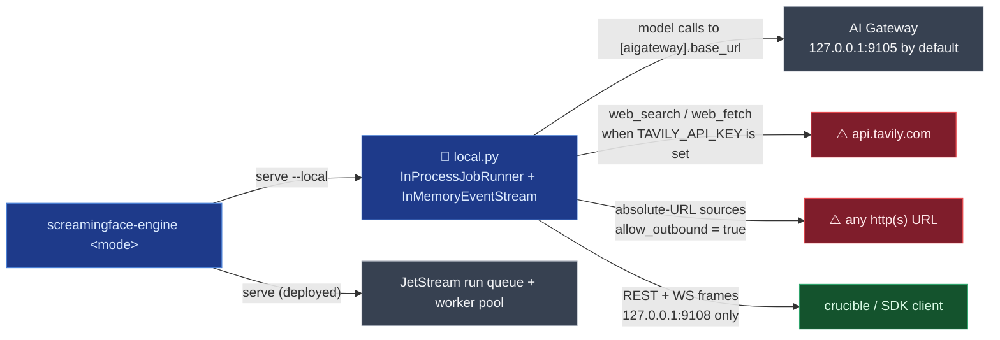

# screamingface_engine (outside `benchmarks/`)

## Mental model
The engine ships as one artifact that behaves as a different program depending on `argv[1]`
(`cli.py`) — never sniffed from environment, so a misconfigured pod fails loudly at boot instead of
silently booting the wrong thing. `serve` is the control plane: mints capability JWTs, bridges a
WebSocket to clients, and schedules runs — deployed onto a NATS JetStream run queue drained by a
fixed worker pool (the Kubernetes Job adapter is retired, `adapters/factory.py:34-35`, OME-1092),
or, in `--local` mode, onto an in-process `asyncio.Task`. `run` executes exactly one url4
expression and exits; it is what a worker's child process runs. For Crucible, `serve --local` is the shape: one process, no cluster,
no message broker. Think of it as a sealed exam room whose door (the listener) only opens onto the
corridor (loopback) — but whose phone lines (the run's outbound HTTP clients) still work unless
you cut them.

## Surface Crucible touches
- **The modes** (`cli.py:1-24,111-164`) — `serve` (default when no subcommand given), `run`,
  `worker`, `node`. `_PORT = 9108` (`cli.py:30`) is hardcoded on
  both the CLI side and the Helm chart's `containerPort`, changed in the same commit
  (`cli.py:42-46`); `_serve` and `_serve_local` read no port from the environment
  (`cli.py:53-55,73-75`).
- **`local.py` — the local-mode composition root** (`local.py:1-25`) — the only module where the
  control plane and the run mode meet (`check_layering.py` lists it in `CONTROL_PLANE` and `_EXEMPT`,
  as it does `cli.py`; `local.py:15-19`). Swaps two adapters — `InProcessJobRunner`
  (`adapters/inprocess.py`) runs each job as an `asyncio.Task`; `InMemoryEventStream`
  (`adapters/memory.py`) replaces JetStream for event frames. "Everything above the two swapped
  adapters — auth, the 428 subscriber gate, sequencing, replay-from, the model catalog — is the
  production code path, unmodified" (`local.py:7-9`).
- **`LOCAL_HOST = "127.0.0.1"`** (`local.py:76-80`) — hardcoded, "not configurable for that
  reason": local mode skips `_require_prod_secret`, so it may run on the publicly-known dev JWT
  secret; the loopback bind is what keeps that reachable only from the same machine.
- **The `--local` flag** (`cli.py:125-133`) is a flag on `serve` that dispatches to the sibling
  `_serve_local` (`cli.py:58-75,161-162`): "runs execute as asyncio tasks and frames travel an
  in-memory stream, so neither Kubernetes nor NATS is needed. Binds loopback only."
- **`_node()`** (`cli.py:96-108`) — "the control plane schedules runs and owns
  identity, the node tier executes one direct mount hit and holds no caller state." Its port comes
  from `world/node_tier/settings.py` env vars (`PORT_ENV`, `METRICS_PORT_ENV`,
  `settings.py:30-31,148-149`), and its host defaults to `0.0.0.0` (`settings.py:84`).
- **Two gateway addresses, two jobs.** (1) Control-plane calls — `AigatewayConnections`
  (`connections/aigateway.py:67`; paths `/v1/providers`, `/v1/oauth/connections`,
  `/v1/provider-access`, `/v1/oauth/connections/api-key`, `:36-40`) and the model catalog
  (`catalog/aigateway.py`, `/v1/models`) — use `Settings.aigateway_base_url`
  (`URL4_CLOUD_AIGATEWAY_BASE_URL`, `config.py:42,148`), which local mode fills with
  `LOCAL_AIGATEWAY_BASE_URL = "http://127.0.0.1:9105"` (`config.py:35,241-253`; `local.py:162-171`)
  only when unset. (2) A run's **model calls** go through the world's own `httpx` client
  (`world/connector.py:417-422`) to `[aigateway].base_url` from `url4.toml` (default
  `http://127.0.0.1:9105`, `world/config.py:495`), overridden by the `AIGATEWAY_BASE_URL` env var
  (`world/config.py:578-579`). Pinning only the Settings field does not pin the model-call target.
- **The wire protocol** (`docs/protocol.md`) — CloudEvents 1.0 envelopes over three transports
  carrying the *same* message shape: native objects in-process, JSON over NATS, JSON over WebSocket
  — "The app is a bridge, not a translator" (`protocol.md:46-47`). Runs start over REST
  (`GET /?q=…`), never the socket; the inbound WS command set is Stop + Attach only
  (`protocol.md:66-71`). Capability tokens travel on `URL4-Capability: <JWT>` (HS256, RFC 7519
  claims), deliberately not on `Authorization` (`protocol.md:152-159`) — "that slot is the
  caller's primary identity, often owned by a gateway/mesh that could strip or overwrite it."

## Defaults & invariants that matter
- **`serve --local` needs neither Kubernetes nor a message broker** (`local.py:5-9`; it wires
  `InProcessJobRunner` + `InMemoryEventStream`, `local.py:387,425-439`). That answers "can the
  engine run inside a sealed enclave with no external orchestration" — yes.
- **Loopback listener ≠ zero egress.** Outbound clients found by grepping `httpx.AsyncClient(`,
  `nats.connect`, `https://` and env reads outside `benchmarks/`:
  - **AI Gateway** — the two addresses above; both default to loopback in local mode.
  - **Tavily, direct from the engine** — `tavily_base_url = "https://api.tavily.com"`
    (`world/connector.py:244`), client built whenever `TAVILY_API_KEY` is set
    (`world/web_tools.py:100-108`, key read at `world/factory.py:218`). Local mode hands runs the
    whole process environment (`local.py:398`, `adapters/inprocess.py:107,174`), so an ambient key
    turns it on. Routes default to `web_search = True` (`world/config.py:169`), and DRACO's
    candidate asks for search (`benchmarks/draco/exam.py:198-199`).
  - **url4 absolute-URL fetches** — `allow_outbound` defaults to `True` (`world/config.py:193,498`;
    `world/connector.py:242`) and the repo's `url4.toml:57` sets it `true`; left on, the node
    lazily builds an `HttpIOLayer` that "can fetch any URL" (`world/connector.py:440-447`). Local
    mode keeps the declared value rather than the node tier's forced-off layer (`local.py:289-294`).
  - **Deployed-only / opt-in:** NATS (`adapters/jetstream.py:162`, `worker/loop.py:560`), S3
    artifacts when `URL4_CLOUD_ARTIFACT_STORE=s3` (`artifacts/wiring.py:49-50`), OTLP export in the `run`
    child when `OTEL_EXPORTER_OTLP_ENDPOINT` is set (`runner/main.py:467-485,645`).
  Crucible has to set `allow_outbound = false`, leave `TAVILY_API_KEY` unset (or set
  `web_search = false` per route), and point `AIGATEWAY_BASE_URL` at loopback — or enforce egress
  at the enclave's network layer.
- **Local-mode direct-mount ("sync") calls skip the node tier's guards**: "no 30 s
  timeout ladder, no admission cap, no missing-``q`` 400 and no fair-share gate — only the
  in-process runs are gated" (`local.py:11-13`). Crucible in `--local` mode must not assume the
  backpressure/timeout protections a deployed cluster gives.
- **`ws_ping_interval=20` / `ws_ping_timeout=20` are load-bearing** (`cli.py:47-52`, OME-890):
  they detect a partitioned/sleeping client within ~40s and arm the orphan-run reaper. Both
  `uvicorn.run` calls (`cli.py:53-55,73-75`) pass no ping arguments, so uvicorn's defaults apply;
  overriding them silently breaks orphan cleanup.
- **The engine holds no AI Gateway secret** (`config.py:180-183`) — provider credentials live in
  the gateway process. It can still hold other credentials when configured: `TAVILY_API_KEY` and
  the S3 access keys (`job_env.py:295,362`).
- **Mode selection is argv-only, never environment-sniffed** (`cli.py:16-19`) — a Crucible
  deployment script must pass the mode explicitly.

## Watch list
- `docs/execution-flow-diagrams.md` and `docs/request-workflow.md` are not covered here — read them
  if Crucible needs the exact request lifecycle rather than the topology-level facts above.
- Deployed scheduling is `runner="queue"` → `QueueJobRunner` only (`config.py:12`,
  `adapters/factory.py:31-36`); `K8sJobRunner` is gone (OME-1092). Irrelevant to `--local`, but
  any Crucible notes that still mention per-run Kubernetes Jobs are out of date.
- `node` mode binds `0.0.0.0` by default (`world/node_tier/settings.py:84`) — irrelevant to a
  `--local`-only deployment, but a trap if Crucible ever runs the node tier inside the enclave.
