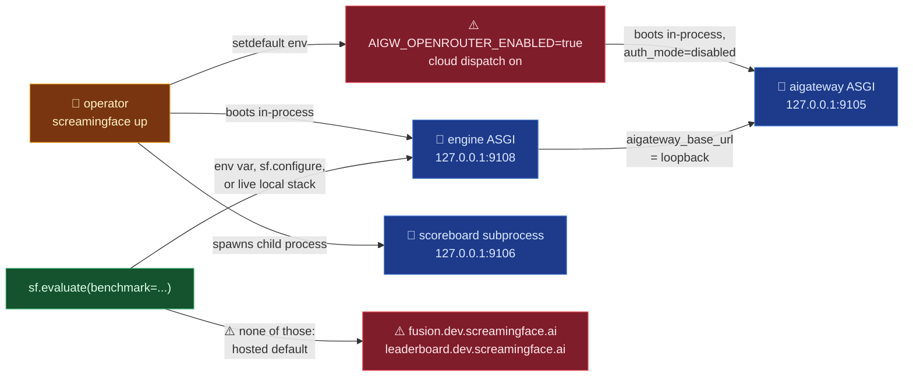

# screamingface/screamingface-client

## Mental model
Two things live in one wheel: a thin SDK (`sf.Model`, `sf.Fusion`, `sf.Pipeline`, `sf.evaluate`)
that composes "Candidates" and sends them at a Benchmark, and a runtime launcher
(`screamingface up`/`down`/`status`) that boots the three services a local evaluation needs —
AI Gateway, Scoreboard, Engine — each bound to `127.0.0.1`. Think of the SDK as a phone with a
default number: unless told otherwise (env var or `sf.configure`) it first checks whether a local
stack answers, and if none does it dials the hosted Engine. `evaluate(...)` fetches a Benchmark's
canonical url4 expression, links every Candidate into it, and runs the whole thing as one Engine
job; grading, judging, and the Benchmark's private material are not exposed to the SDK
(`README.md:45-108`). For Crucible this package is both the client library to import and the
concrete recipe for "what does colocating Gateway+Engine+Scoreboard in one process look like."

## Surface Crucible touches
- **`sf.Model`/`sf.Fusion`/`sf.Pipeline`/`sf.evaluate`** (`README.md:45-108,152-207`) —
  `Model` is atomic; `Fusion` runs members in parallel then a required, explicitly-named
  `synthesizer` combines them; `Pipeline` runs stages serially, each stage seeing only the
  previous stage's answer ("No original input or accumulated history is injected implicitly").
  `.then(...)` is immutable Pipeline shorthand. `evaluate(...)` requires an explicit `benchmark=`
  id — "There is no implicit default Benchmark selection" — and "All no-spend validation finishes
  before the first paid Run starts" (`README.md:72-73`; enforced at `_default_client.py:149-150`).
- **Which Engine `sf.evaluate` talks to** (`_default_client.py:24-64`, OME-998): (1)
  `SCREAMINGFACE_ENGINE_URL` / `SCREAMINGFACE_SCOREBOARD_URL` if set (`:40-41`); else (2) a live
  local stack found via `~/.screamingface/runtime.json` plus a 0.3 s `/healthz` probe
  (`_runtime/detect.py:46-62`), announced with a print (`:54-57`); else (3) **silently** the hosted
  defaults `https://fusion.dev.screamingface.ai` and `https://leaderboard.dev.screamingface.ai`
  (`client.py:37-38`, used at `_default_client.py:58-63`). `sf.configure()` and `sf.Client()` also
  default their parameters to those hosted URLs (`_default_client.py:67-71`, `client.py:47-48`).
  The README's "the SDK does not switch away from its hosted defaults automatically"
  (`README.md:29-30`) is stale on the local-stack half: the code does adopt a live local stack.
- **Replay**: `score.url4.to_python()` is local and no-spend, returning editable Python source, not
  live objects; `sf.evaluate(score.url4)` (a pre-linked, complete url4) rejects
  `benchmark=`/`limit=` (`README.md:83-90`; `_default_client.py:138-142`). Every client-compiled
  Candidate URL4 carries exactly one inert `_sf_recipe` descriptor (`screamingface.recipe.v1`)
  preserving the authored Recipe structure for replay/`to_python()` (`README.md:94-97`).
- **`screamingface up`/`down`/`status`/`doctor`/`logs`/`restart`** (`README.md:11-30`;
  subcommands `_runtime/cli.py:41-78`, `_up` `:176`) — default ports Gateway **9105**, Scoreboard
  **9106**, Engine **9108** (`cli.py:27`), overridable via
  `--gateway-port`/`--scoreboard-port`/`--engine-port` or `SCREAMINGFACE_{GATEWAY,SCOREBOARD,ENGINE}_PORT`
  (`cli.py:154`). State under `~/.screamingface` or `SCREAMINGFACE_DATA_DIR`/`--data-dir`
  (`_runtime/config.py:13-16`).
- **`require_runtime_extra()`** (`_runtime/server.py:126-163`) — probes runtime-only modules
  (`aiosqlite`, `fastapi`, `litellm`, `tortoise`, `uvicorn`, …, `server.py:91-102`) via
  `find_spec` before importing `aigateway`, `scoreboard`, `screamingface_engine`, `url4`
  (`:145-148`). A missing extra fails with "Install `screamingface[runtime]`", not a bare
  `ModuleNotFoundError`. It also calls `enable_local_providers(os.environ)` (`:143`) — see below.
- **`run()` — the process topology** (`server.py:166-227`): `aigateway` and `screamingface_engine`
  are served as two ASGI apps (`create_gateway_app`, `create_local_app`) in the same asyncio loop,
  each on its own uvicorn server (`server.py:189-192`) bound to `127.0.0.1` (`_server`,
  `:315-335`). **Scoreboard runs as a child subprocess** (`server.py:193-215`,
  `screamingface._runtime.cli _scoreboard`, itself bound to `127.0.0.1` at `:311`).
- **What the wheel ships**: five top-level packages — `screamingface`, `aigateway`, `scoreboard`,
  `screamingface_engine`, `url4`. `pyproject.toml:103-107` lists only `src/screamingface`, and the
  custom hook `scripts/runtime_build_hook.py:31-65` copies the other four (plus the scoreboard
  portal/artifacts and the engine's `url4.toml`) into the wheel. Crucible's installed
  `screamingface-0.1.1.post9.dist-info/RECORD` confirms it (253 `aigateway/`, 52 `scoreboard/`,
  163 `screamingface/`, 256 `screamingface_engine/`, 65 `url4/` entries; no
  `screamingface_engine_inspect/`, so the engine's inspect boards never load — see
  `screamingface/engine-benchmarks`). The vendored `url4/` lands in the same directory as
  Crucible's separate `url4` dependency; today both come from the same commit and hash
  identically (see `screamingface/url4` → Watch list).
- **Gateway auth is disabled for local runs**: `GatewaySettings(host="127.0.0.1",
  port=config.gateway_port, ..., auth_mode="disabled")` (`server.py:254-259`). The gateway itself
  then refuses non-loopback clients/Host headers (see `screamingface/aigateway`). The Engine gets
  `aigateway_base_url=config.services["gateway"]` (`server.py:268`), and every Engine job inherits
  the full parent `os.environ` plus the runner config (`server.py:261-266`).
- **`_refuse_foreign_gateway_database`** (`cli.py:253-268`, first call in `_up` at `:180`)
  — refuses to boot when `AIGATEWAY_DATABASE_URL` is set, "instead of after a paid
  run recorded into the wrong database" (OME-1169).

## Defaults & invariants that matter
- **The SDK egresses by default.** With no `SCREAMINGFACE_ENGINE_URL`/`SCREAMINGFACE_SCOREBOARD_URL`
  and no live local stack, the first `sf.evaluate`/`sf.connect` goes to
  `fusion.dev.screamingface.ai` without a warning (`_default_client.py:58-63`). The hosted login
  flow also polls `https://login.cloudflareaccess.org` (`_access/auth.py:35,513`). Crucible must
  set both env vars or call `sf.configure(engine_url=..., scoreboard_url=...)` (or build its own
  `sf.Client(...)`) before the first operation; a stale `runtime.json` with a dead Engine drops
  back to the hosted default too (`detect.py:53-62`).
- **`screamingface up` turns on OpenRouter cloud dispatch.** `enable_local_providers` setdefaults
  `AIGW_OPENROUTER_ENABLED=true` and `AIGW_PROVIDER_MAX_CONCURRENCY_OVERRIDES={"openrouter": 32}`
  into `os.environ` (`_runtime/bootstrap.py:28-45`, called at `server.py:143`), while the gateway's
  own default is off (`aigateway/plugins/openrouter_provider/settings.py:216`). An operator who
  wants it off must export `AIGW_OPENROUTER_ENABLED=false` before `up`. "Loopback-bound" describes
  the listening sockets only; outbound model calls still leave the host.
- **Crucible's `.venv` does not have the runtime extra installed.** Crucible depends on bare
  `screamingface` (no `[runtime]`), and `litellm`, `fastapi`, `uvicorn`, `tortoise`, `aiosqlite`
  are absent from its site-packages, so `screamingface up` from it stops at
  `require_runtime_extra` with the "Install `screamingface[runtime]`" error (`server.py:126-163`).
- **`screamingface up` is one parent process (Gateway + Engine, same event loop) plus one child
  subprocess (Scoreboard)**, every listener on `127.0.0.1`. Crucible packaging this for an enclave
  needs one Python entry point plus tolerance for one child process.
- **Candidate overrides can't reach Benchmark-owned territory**: prompt/param overrides on a
  `Model`/`Fusion` "never alter Benchmark-owned Cases, fixed Judge models or prompts, Grading, or
  Aggregation" and "Transport, routing, tool, and Benchmark-policy fields remain unavailable
  through Candidate `params`" (`README.md:144-150`). This is the SDK-side half of the seam
  `screamingface/engine-benchmarks` enforces from the engine side.
- **A parameter-free Model emits no sampling/retrieval parameters** — it "uses the Engine's
  configured defaults" (`README.md:147-148`).
- **`inspect` is a separately versioned extra pinned to `inspect-ai==0.3.263`**
  (`pyproject.toml:42-48`) so the `.eval` exporter and the Engine's importer
  speak the same dialect (OME-1117). It is declared as conflicting with the `runtime` extra
  (`pyproject.toml:81-92`: `inspect-ai` and `litellm==1.98.0` cannot co-install). Crucible must
  keep any `inspect-ai` pin of its own in lockstep if it ever touches `.eval` export.
- **The installed `draco` Benchmark is always the complete 100-task protocol; `limit=` only bounds
  how many Cases run** — it never changes the judge count (five passes) or judge model
  (`openrouter/google/gemini-3.1-pro-preview`). A non-canonical variant gets its own id
  (`healthbench-worst30`) (`README.md:99-108`).

## Watch list
- The hosted fallback is decided in three places (`client.py:37-38`, `_default_client.py:58-71`,
  `detect.py`); a Crucible guard that asserts `sf` never resolves to a non-loopback origin should
  check `default_client().engine_url` after configuration rather than trust env alone.
- `run_env` forwards the whole parent environment into Engine jobs (`server.py:261-266`); any
  provider key exported for the gateway is visible to job code too.
