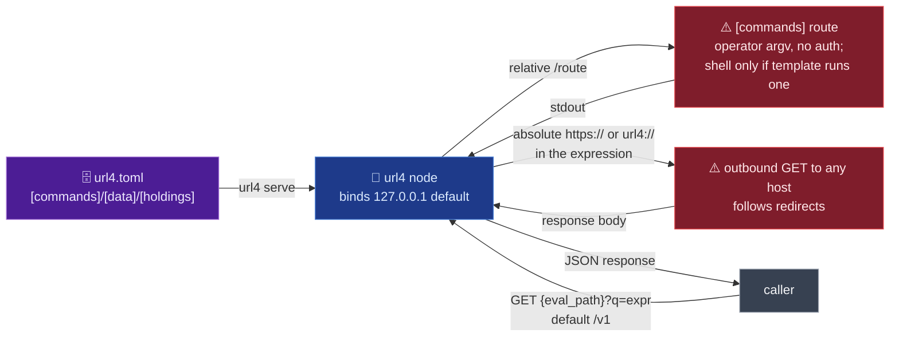

# screamingface/url4

## Mental model
A url4 expression reads like a tiny program that's also a URL: `(sources)!intent` — sources in
parentheses (each can itself be a nested url4 expression, so expressions form a recursive DAG),
then a bang and the intent applied to whatever the sources resolved to. `$name`/`$N` are lexical
references into that same scope. The compiler is pure text→AST→typed-DAG, with all I/O behind an
`IOLayer` port. `url4 serve` is the HTTP wrapper that turns one config file (`url4.toml`) into a
live node. Think of the node as a switchboard: a relative source (`/route`) is patched to one of
its own `[commands]`/`[data]`/`[holdings]`/`[identities]` routes, and an absolute source
(`https://…`, `url4://…`) is patched straight out to the network. For Crucible, `url4.toml` is the
config shape the planned one-file emitter (`emitter.py`, not in the repo yet) has to produce, and
this node is what runs model/tool calls once Crucible's expression lands.

## Surface Crucible touches
- **`url4.toml` schema** (`README.md:92-114`) — top-level `host`, `port` (default 4404,
  `cli/_config.py:73`), `eval_path` (GET-only eval endpoint, default `/v1`), `default_route` (the
  reduce backend for a fan-out, defaults to the first declared command — "only a sensible reduce
  backend by coincidence; name one deliberately"). Sections: `[commands]` (route → argv template,
  a TOML list or a string that is `shlex.split`, `cli/_config.py:271-276`), `[data]` (bare
  relative URIs a route can resolve, each entry a string or exactly one of `value`/`file`/`command`),
  `[holdings]` (`@`, the node's own shelves), `[identities.<name>]` (another party's
  `@name`/`@name/shelf`).
- **Command substitution tokens** (`README.md:116-129`; `cli/_serve.py:110-132`) — `{intent}`,
  `{context}` (also piped to stdin by default; `stdin="intent"` pipes the intent instead,
  `cli/_serve.py:56-58`), `{param:<name>}` (empty string if absent), `{params}` (all params as
  JSON). Substitution is single-pass over the operator's template, so token-shaped text in a
  caller's input stays literal and never expands into another token. That blocks token
  cascading only. **Whether caller text becomes a shell command is decided by the route
  template, not by url4**: `create_subprocess_exec` runs the argv without a shell
  (`cli/_serve.py:135-165`), but the README's own example `"/bash" = "bash -lc {intent}"`
  (`README.md:106`) hands the caller's intent to bash. Crucible's emitter must never put
  `{intent}`/`{context}`/`{param:*}` inside a shell or interpreter `-c` argument.
- **Commands must be idempotent** (`README.md:131-134`; `cli/_serve.py:135-141`) — a timeout
  kills the process and raises a non-permanent `ResolutionError`, and the engine cannot tell
  "never ran" from "ran, answer lost", so a `;retry=N` source re-runs the same command. Any
  Crucible-authored command backend must be safe to run twice.
- **Precedence for config resolution**: CLI flags > env vars (`URL4_HOST`, `URL4_PORT`,
  `URL4_DEFAULT_ROUTE`, `URL4_EVAL_PATH`, `URL4_CONFIG`, …) > `url4.toml` > built-in defaults
  (`README.md:178-187`; `cli/_config.py:189-229`). An **empty** env var counts as unset
  (`cli/_config.py:221-228`) — `URL4_HOST=` falls through to the TOML value.
- **`ServeConfig.host` defaults to `"127.0.0.1"`** (`cli/_config.py:72`, resolver default `:201`)
  and an empty host string is rejected, never treated as "unset" — `cli/_config.py:92-100`: "an
  empty host is never a loopback bind — it binds 0.0.0.0 AND ::."
- **Fan-out/reduce semantics**: for `(a, b)!'pick'`, both per-source results are merged into
  `default_route`'s `{intent}` with empty stdin — "a reduce backend must consume `{intent}`"
  (`README.md:110-114`).
- **`$index`/`$item` inside `collection*(...)`** (`README.md:65-82`) — `$index`
  is the zero-based position assigned before concurrent execution and after `iteration.slice`;
  retries keep it, skipped failures don't renumber later rows; `$index` is reserved and shadows an
  author binding named `index` only inside an iteration.

## Defaults & invariants that matter
- **A command route is local execution reachable over HTTP, by design** — "that is the point of
  the feature, and it is why the node binds `127.0.0.1` by default" (`README.md:189-192`).
  Loopback is exactly `127.0.0.1`, `::1`, `localhost` (`cli/app.py:30`); any other host prints a
  warning naming the command routes now reachable (`cli/app.py:138-142`). A warning is the only
  control; nothing refuses a non-loopback bind.
- **The eval endpoint is an open outbound fetcher.** Any absolute source in a caller's expression
  goes to the node's outbound `IOLayer` (`peer/_dispatch.py:79-91`); `build_node` passes none
  (`cli/_serve.py:242-259`), so the node lazily owns an `HttpIOLayer` (`peer/_owned.py:16-19`,
  `peer/server.py:81`). That client is `httpx.AsyncClient(follow_redirects=True)`
  (`io/http.py:57`) with no host allowlist, and `url4://` is rewritten to `https://`
  (`io/http.py:70-74`). So anyone who can reach the eval path can make the node GET any URL,
  including link-local metadata endpoints and hosts reached only by redirect, and the body becomes
  route context (a route that echoes it, like `cat`, returns it). In an enclave this is egress
  Crucible must block at the network layer or by injecting its own `outbound` layer; url4 has no
  switch for it.
- **`url4 serve` ships no authentication or authorization of its own**: "Put an authenticating
  reverse proxy in front of the node before exposing it" (`README.md:203-204`). Crucible must
  supply that proxy (or keep the node loopback-only, matching `screamingface/engine-core`'s
  `serve --local`).
- **Config errors fail fast, before the bind, exit code 2** (`README.md:198-201`): an
  undeclared `default_route`, empty `[commands]`, a malformed `eval_path` or one colliding with
  `/healthz`, a `[data]` path clashing with a command or reserved route, an invalid identity name,
  or a provider declaring zero or several of `value`/`file`/`command`. Crucible's emitter can rely
  on a bad config never partially starting the node.
- **`file` providers re-read per request** (no restart needed to pick up an edit); `command`
  providers run with **no shell and empty stdin**, using only the argv template and stdout
  (`README.md:157-159`).
- **`{eval_path}/...` is reserved** — declaring a `[commands]` or `[data]` route under the eval
  path prefix is a config error, not a silent shadow (`README.md:175-176`;
  `cli/_config.py:112-119`).
- **Error responses are a fixed, small JSON shape** (`README.md:226-236`): `400` parse/unbound
  reference, `404` unknown route, `502` command exited non-zero, `503` over `--max-inflight`,
  `504` over `--timeout` — `{"error": {"code": ..., "message": ...}}`.

## Watch list
- The outbound fetcher has no allowlist hook in `url4.toml`; the only seam is the `outbound=`
  argument of `Url4Node` (`peer/server.py:66-81`), which `url4 serve` does not expose. A Crucible
  deployment that runs `url4 serve` unchanged gets the open fetcher.
- A caller can pick the reduce processor per request ("the request's `processor=` wins",
  `peer/server.py:236-248`), so every declared command route, not only `default_route`, is
  caller-selectable.
- **Two wheels install the same `url4/` directory.** The `url4` wheel ships it, and the
  `screamingface` wheel's build hook vendors a copy too ("Copy url4 and the three apps into the
  wheel", `packages/screamingface/scripts/runtime_build_hook.py:32,64`). Crucible's `uv.lock`
  resolves both from the same commit today, and all 65 `url4/` entries in the two installed
  `RECORD` files hash identically — so no conflict now. It returns the moment the two lock
  entries drift apart (e.g. `uv lock --upgrade-package screamingface` without `url4`): the
  last-installed wheel then silently wins every differing file.
