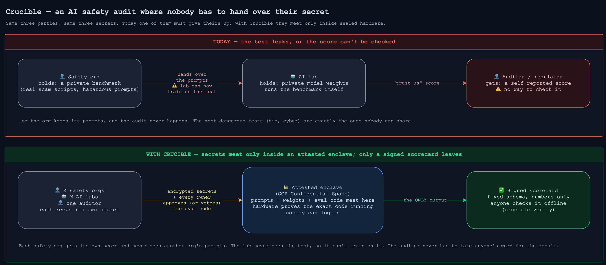

# Crucible

**Run an AI safety evaluation on a private model with a private benchmark, and let anyone check the result, without anyone handing over their secret.**

> **Status:** design complete · implementation starting · the prototype this grows from ([Blindfold](https://github.com/khoaguin/blindfold)) already ran a three-party audit on real attested hardware. Full design: [`docs/architecture.md`](docs/architecture.md).

## TLDR

Today, a safety audit makes the parties choose: the benchmark owner shows its test to the AI lab, and the lab can train on it, or everyone takes the lab's word for its own score. **Crucible puts the model weights, the private benchmark and the auditor's evaluation code inside an attested hardware enclave that nobody can look into, and lets exactly one thing out: a fixed-schema, signed scorecard that anyone can verify offline.** It is built for many mutually distrusting benchmark owners in one audit. Its first case study asks whether LLMs specialised for Vietnamese are least safe in Vietnamese.

## The problem: three secrets with no safe place to meet

Think of an AI safety audit as an exam.

- **The AI lab is the student.** Its model sits the exam, and the model weights are its secret.
- **The safety org is the examiner who wrote the questions.** Its benchmark has to stay secret: a student who sees the questions can memorise them, which ruins the benchmark forever. Some of the questions are also dangerous to publish, such as real scam scripts, or bio and cyber misuse prompts.
- **The auditor is whoever needs the report card:** a regulator, or a bank buying an AI system. It also brings the grading logic, the evaluation code.

Nobody will hand their secret to anyone else. So today the exam either leaks, or the grade can't be checked, and **the most dangerous tests are exactly the ones nobody can share, so they are the least verifiable.**

**Crucible is a sealed exam hall.** All three secrets go in, nobody can watch, and only a signed report card comes out.

## How one audit runs

This is the designed flow; the implementation is starting now (see [status](#what-exists-today)).

1. **Check the hall.** Before uploading anything, each party verifies a hardware attestation. That's Google's signed proof that this exact container image, with debugging disabled, is running in a [GCP Confidential Space](https://cloud.google.com/confidential-computing/confidential-space/docs) VM that nobody can log into. Upstream makes the image-digest check optional; **Crucible makes it mandatory, and treats a skipped check as a failure.**
2. **Approve the grading.** Every owner reviews the auditor's eval code and a few mock rows. **Any single owner can veto, and a vetoed job never runs.**
3. **Seal in the secrets.** Model weights and prompts arrive encrypted to the enclave's key.
4. **Sit the exam.** Inside the enclave, the eval runs four stages: load → run → grade → aggregate. The judge model that grades the answers runs inside the enclave too, so no answer is ever sent to an outside API.
5. **One report card out.** The only output is a fixed-schema Scorecard: numbers only, length-bounded, Ed25519-signed. Each benchmark owner's score on its own prompt set is sealed so only that owner can read it.
6. **Anyone checks it, offline.** `crucible verify` checks the scorecard's signature, Google's attestation, the image digest and a per-audit freshness nonce. There is nothing to take on trust.

## Many owners, one audit

The three-party audit is only the simplest case. Crucible is designed for **K benchmark owners + M AI labs + one auditor**, in a single run. For example, three national safety institutes, each with its own private prompt set, can audit one model together. Each gets its own score, and none sees another's prompts. Every owner also receives the combined score. Because that is an average over K sets, one owner cannot recover another's exact score when K ≥ 3; the design states the remaining interval leakage as a declared residual rather than hiding it.

The same machinery audits two labs' private models and their fusion in one run, and answers *does the fusion beat each model alone?* without either lab seeing the other's weights, answers or score.

## What exists today

| Piece | State | Evidence |
|---|---|---|
| Prototype ([Blindfold](https://github.com/khoaguin/blindfold)) | ✅ done, June 2026 | A three-party audit ran end to end on real GCP Confidential Space with hardware attestation. It placed in the top 10% of 217 entries at the Apart Research × AnToàn.AI Global South AI Safety Hackathon |
| Design | ✅ done | [`docs/architecture.md`](docs/architecture.md): the threat model, the multi-party consent protocol, the scorecard schema, a four-experiment evaluation plan and 20 diagrams. It maps each hackathon reviewer's request on Blindfold to where the design answers it |
| Upstream fix | ✅ merged | A digest-pinning gap in PySyft's enclave attestation, found and fixed by this project ([#9454](https://github.com/OpenMined/PySyft/pull/9454), fail-closed), then extended upstream to digest-pinned deploys ([#9481](https://github.com/OpenMined/PySyft/pull/9481)) |
| Dependencies | ✅ wired | PySyft `dev` and ScreamingFace `main`, with the exact commits recorded in `uv.lock` |
| Crucible code | ⏳ starting | First milestone: the whole audit runs as a notebook on a laptop, with the veto demo, a "what left the enclave" inspection and a tamper-fails check |
| Attested Crucible run, scaled benchmark, paper | 🔜 next | See the [roadmap](#roadmap-four-experiments-each-with-a-passfail-check) |

## The first finding, and what it still has to survive

In Blindfold's 47-prompt bilingual benchmark, every harmful prompt cites a real Vietnamese source: the national fraud catalogue, Ministry of Health warnings, real scam scripts. On it, `phogpt-4b`, the model built for Vietnamese, **refused only 14% of harmful prompts in Vietnamese, against 38% in English. An English-only audit would miss this entirely.**

It is a hackathon result, and it needs hardening. The prompt set is small, it used one seed and a heuristic judge. Review also found two confounds. PhoGPT's English prompts were wrapped in its Vietnamese chat template, so 42 of the 47 were answered in Vietnamese. And some of its English "refusals" are degenerate output, such as greeting loops, that inflate the gap. Experiment E1 below fixes all of these before the finding is claimed. The full list of holes and their fixes: [Blindfold → Crucible](docs/diagrams/17-blindfold-to-crucible.drawio.png).

## Roadmap: four experiments, each with a pass/fail check

| Experiment | What it proves | Passes when |
|---|---|---|
| **E1 — the finding** | Language-specialised models can be least safe in their own language | ~100–150 bilingual prompts with per-prompt provenance · 6–10 models × 3 seeds · mean ± CI and a bootstrapped EN↔VN gap · judge validated against human labels, Cohen's κ reported |
| **E2 — two-sided audits** | Several private prompt sets × two labs' private models and their fusion, sealed per owner | up to 6 parties in one run; each gets only its own view |
| **E3 — is it practical?** | The cost of the enclave | overhead vs. a normal VM (tokens/s, wall-clock, boot + attestation) · one full attested Confidential Space run · one confidential-GPU (H100) run |
| **E4 — verification drills** | The security claims are demonstrated, not asserted | `crucible verify` passes a good run and **rejects** a tampered scorecard, a wrong-image enclave and a vetoed job |

E1, E3 and E4 carry the paper; E2 is additive. The build goes riskiest-first:
- a laptop notebook with a mocked enclave;
- the stack running attested in a real enclave, with `crucible verify`;
- real content;
- the full numbers;
- the multi-party showcases;
- a paper for a peer-reviewed security venue.

Detail: [evaluation plan](docs/architecture.md#9-evaluation-plan) · [build order](docs/architecture.md#10-paper-skeleton--build-order).

**Now:** E1, E3 and E4, on a design that already handles K owners. **Later:** the E2 showcases, and "living" benchmarks that owners regenerate from their own data ([§12](docs/architecture.md#12-future-work-paper-v2--living-benchmarks-from-syft-spaces)). **Out:** claiming a model is "safe" in general, since an audit measures one benchmark; and TEEs other than GCP Confidential Space for now, because `crucible verify` checks Google's attestation format.

## Open problems, stated up front

A trust-minimised system is only as honest as its list of holes. These are open today, and each is tracked in the [threat model](docs/architecture.md#8-threat-model--who-can-cheat-and-what-stops-them):

- **Attestation freshness.** Upstream accepts an expired attestation token for about a month, and nothing proves a token was minted *now*. The fix is a per-audit nonce chosen by the verifier plus token refresh inside the enclave. `crucible verify` implements the checking half; the enclave side is a planned upstream PR.
- **Network egress from job code.** Job code runs as an ordinary subprocess with the runner's network. The fixed-schema scorecard closes the *output* channel, but a kernel sandbox that blocks sockets lives only on an unmerged PySyft branch. Until it lands, this stays a declared open risk.
- **The enclave's inbound HTTP port.** Upstream's container serves HTTP on port 8080. Crucible's image must expose no inference route there, and its deploy must open no ingress.
- **Timing and side channels.** These are analysed with a leakage estimate (bits per run through a numeric schema) and declared as residual risk, with padding and quantisation held in reserve.

## Related work

Crucible is not the first enclave-based evaluation, and doesn't claim to be:

- **Google DeepMind's [double-blind evaluation pilot](https://deepmind.google/blog/piloting-the-worlds-first-double-blind-ai-evaluations/)** (August 2026) evaluated Gemini 2.5 Flash Lite against reserved MLCommons AILuminate safety prompts on GCP Confidential Space with an H100 confidential GPU. Partners included the Singapore AI Safety Institute and OpenMined.
- **Tinfoil's [double-blind-eval](https://github.com/tinfoilsh/double-blind-eval)** (September 2026) is an open two-party version: a private prompt set against a private LoRA adapter, with a signed receipt anyone can verify offline. It says it was inspired by PySyft's double-blind evaluation.
- **The UK AISI × Anthropic enclave run** ([2024 write-up](https://openmined.org/blog/secure-enclaves-for-ai-evaluation/)) found that governance, not compute, was the bottleneck: 28 minutes of approvals around 1 minute 11 seconds of execution. It left side channels as an open problem.

**What Crucible adds:**
- N mutually distrusting owners in one audit, each sealed from the others;
- an in-enclave judge validated against human labels;
- the claim set as open code anyone can run (`crucible verify`);
- an open measurement study of a safety gap that English-only audits miss.

## Built on

- **[PySyft](https://github.com/OpenMined/PySyft)** provides the enclave runtime: multi-party approval, attestation, and encrypted file sync between parties.
- **[ScreamingFace](https://github.com/ScreamingFace/screamingface)**'s `url4` provides the in-process execution engine. Crucible uses it behind its own seams, so upstream changes land in one file.
- **[inspect_ai](https://github.com/UKGovernmentBEIS/inspect_ai)** is the reference for the load → run → grade → aggregate decomposition. It's a design reference, not a dependency.
- **[GCP Confidential Space](https://cloud.google.com/confidential-computing/confidential-space/docs)** is the attested hardware.

All open source, so the whole pipeline has no closed-source dependencies and can be rebuilt for artifact evaluation.

## Find your way around

| Path | What it is |
|---|---|
| [`docs/architecture.md`](docs/architecture.md) | **Start here for depth.** The problem, the Blindfold reviews and how each is answered, the claims and prior art, the stack inventory, the architecture, one audit step by step, the execution seams, the threat model, the evaluation plan, the build order and what flows back upstream |
| [`docs/diagrams/`](docs/diagrams) | Every figure, as editable `.drawio` source with a PNG export |
| [`.refs-knowledge/`](.refs-knowledge/INDEX.md) | Fact-checked notes on how the upstream code (PySyft, ScreamingFace, inspect) actually behaves, each stamped with the commit it describes |
| `.claude/skills/` | The tooling that keeps those notes current as upstream moves, rereading only what changed |
| `pyproject.toml` · `uv.lock` | Dependencies, tracking PySyft `dev` and ScreamingFace `main` at recorded commits |

## Author

**Khoa Duy Nguyen**: Senior Software Engineer at [OpenMined](https://openmined.org) and a core contributor to PySyft, the enclave stack Crucible runs on. Research Scientist at Tampere University, working on privacy-preserving machine learning: homomorphic encryption, split learning and federated learning ([publications](https://scholar.google.com/citations?user=9Cx8YUIAAAAJ&hl=en)).

Contact: dkn.work@protonmail.com · [LinkedIn](https://www.linkedin.com/in/khoa-duy-nguyen/) · [theduykhoa.com](https://theduykhoa.com)

## License

[Apache-2.0](LICENSE).
